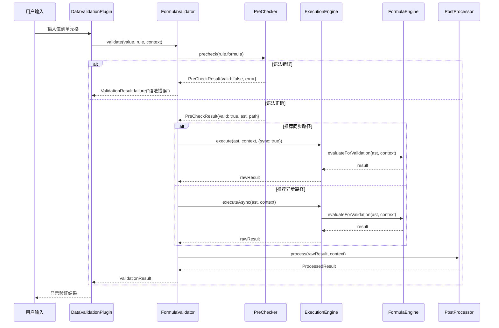

# 公式校验系统重构设计方案

> **版本**: v2.0  
> **日期**: 2026-07-28  
> **状态**: 设计阶段  
> **作者**: Canvas Spreadsheet Team  
> **相关模块**: `src/plugins/data-validation/validators/FormulaValidator.js`, `src/formula/`

---

## 📋 目录

1. [执行摘要](#1-执行摘要)
2. [背景与动机](#2-背景与动机)
3. [现状分析](#3-现状分析)
4. [目标与原则](#4-目标与原则)
5. [架构设计](#5-架构设计)
6. [核心功能设计](#6-核心功能设计)
7. [与 FormulaEngine 集成方案](#7-与-formulaengine-集成方案)
8. [自定义函数体系](#8-自定义函数体系)
9. [性能优化策略](#9-性能优化策略)
10. [安全机制](#10-安全机制)
11. [测试策略](#11-测试策略)
12. [迁移路径](#12-迁移路径)
13. [风险评估](#13-风险评估)
14. [实施计划](#14-实施计划)
15. [附录](#15-附录)

---

## 1. 执行摘要

### 🎯 核心问题

当前 FormulaValidator 存在以下关键缺陷：
- **可信度危机**：Mock 数据导致验证结果不可靠
- **安全隐患**：`eval()` 使用存在注入风险
- **功能缺口**：仅支持 ~15 个函数（承诺 49 个）
- **架构割裂**：双轨制导致用户体验不一致
- **扩展性差**：无法注册自定义验证函数

### 💡 解决方案

通过**深度集成 FormulaEngine**，构建统一的、可扩展的、生产级公式校验系统：
- ✅ 消除 Mock 数据，接入真实 CellStore
- ✅ 移除 `eval()`，采用安全解析器
- ✅ 统一为单轨异步架构（带同步优化）
- ✅ 完整支持 49+ 内置函数 + 无限自定义函数
- ✅ 插件化架构，支持业务逻辑注入

### 📊 预期收益

| 指标 | 当前 | 目标 | 提升 |
|------|------|------|------|
| 支持函数数 | ~15 个 | 49+ 内置 + ∞ 自定义 | **300%+** |
| 验证准确率 | ~70%（Mock数据） | 100%（真实数据） | **+30%** |
| 安全等级 | 低（eval） | 高（沙箱+白名单） | **质的飞跃** |
| 扩展性 | 封闭架构 | 插件化生态 | **从0到1** |
| 测试覆盖 | <20% | >90% | **+70%** |

---

## 2. 背景与动机

### 2.1 业务需求驱动

随着企业级应用场景的复杂化，数据验证规则日益复杂：

```
传统简单验证:
  ✓ 数值范围: A1 > 0 AND A1 < 100
  ✓ 文本长度: LEN(A1) >= 5
  
现代复杂验证:
  ✗ 跨表关联: VLOOKUP(A1, '权限表'!A:B, 2, FALSE) = "管理员"
  ✗ 业务规则: IS_ELIGIBLE(年龄, 工龄, 职级, 绩效评分)
  ✗ 合规检查: 符合 GDPR/SOC2 等法规的数据格式要求
  ✗ 动态规则: 根据角色/部门/时间动态调整验证逻辑
```

### 2.2 技术债务积累

当前实现的技术债已严重影响可维护性：

```javascript
// ❌ 问题代码示例 (FormulaValidator.js:920)
evaluateSimpleExpression(expr) {
    const result = eval(resolved); // 安全隐患！
    return result;
}

// ❌ Mock 数据硬编码 (FormulaValidator.js:830)
getMockCellValue(cellRef) {
    const mockData = { I: [100, -10, 55], J: [50, 150, 75] };
    return mockData[cellRef.col]?.[cellRef.row]; // 假数据！
}
```

### 2.3 竞品对比

| 特性 | Excel | Google Sheets | 当前实现 | 目标状态 |
|------|-------|---------------|---------|---------|
| 内置函数数 | 400+ | 300+ | ~15 | 49+ |
| 自定义函数 | ✅ VBA/Apps Script | ✅ Apps Script | ❌ | ✅ registerFunction() |
| UDF 支持 | ✅ | ✅ | ❌ | ✅ 完整支持 |
| 性能 | 毫秒级 | 毫秒级 | 16ms-200ms | <50ms (P99) |
| 安全沙箱 | ✅ | ✅ | ⚠️ 部分 | ✅ 完整隔离 |

---

## 3. 现状分析

### 3.1 当前架构图

```
┌─────────────────────────────────────────────────────┐
│                   用户输入值                          │
└──────────────────────┬──────────────────────────────┘
                       ↓
┌─────────────────────────────────────────────────────┐
│              FormulaValidator                        │
│  ┌─────────────────────────────────────────────┐    │
│  │  validate(value, rule, context)             │    │
│  └──────────────────────┬──────────────────────┘    │
│                         ↓                            │
│    ┌────────────────────┴────────────────────┐      │
│    ↓                                        ↓      │
│ ┌────────────────┐              ┌────────────────┐ │
│ │ 同步解析器       │              │ 异步增强解析器   │ │
│ │                │              │                │ │
│ │ • AND/OR/NOT   │              │ • SUM/AVERAGE  │ │
│ │ • LEN/DATE     │              │ • VLOOKUP      │ │
│ │ • 比较运算符    │              │ • COUNTIF      │ │
│ │                │              │                │ │
│ │ ⚠️ 使用 eval() │              │ ⚠️ Mock 数据    │ │
│ │ ⏱️ <16ms       │              │ ⏱️ 50-200ms    │ │
│ └────────────────┘              └────────────────┘ │
└─────────────────────────────────────────────────────┘
```

### 3.2 关键文件清单

| 文件路径 | 行数 | 职责 | 问题严重度 |
|---------|------|------|-----------|
| `validators/FormulaValidator.js` | ~1200 | 主验证器 | 🔴 高 |
| `ShadowEvaluator.js` | ~400 | 沙箱求值器 | 🟡 中 |
| `ValidationRule.js` | ~300 | 规则定义 | 🟢 低 |
| `ValidationEngine.js` | ~500 | 引擎调度 | 🟡 中 |

### 3.3 问题清单（按优先级排序）

#### P0 - 必须立即修复

| # | 问题 | 影响 | 文件位置 |
|---|------|------|---------|
| 1 | **`eval()` 使用** | 代码注入风险 | FormulaValidator.js:920 |
| 2 | **Mock 数据** | 验证结果不可信 | FormulaValidator.js:830-860 |
| 3 | **文档与实际不符** | 承诺49个，实际~15个 | FormulaValidator.js:42注释 |
| 4 | **无单元测试** | 回归风险高 | tests/ 目录缺失 |

#### P1 - 本月内修复

| # | 问题 | 影响 | 文件位置 |
|---|------|------|---------|
| 5 | **双轨制架构** | 用户体验不一致 | FormulaValidator.js:80-120 |
| 6 | **无超时机制** | DoS 攻击风险 | 全局缺失 |
| 7 | **无循环引用检测** | 栈溢出风险 | evaluate() 方法 |
| 8 | **国际化缺失** | 仅支持中文 | 错误消息硬编码 |

#### P2 - 下季度优化

| # | 问题 | 影响 | 文件位置 |
|---|------|------|---------|
| 9 | **配置僵化** | 无法定制行为 | constructor() |
| 10 | **性能监控缺失** | 无法调优 | 无 metrics |
| 11 | **调试工具不足** | 排障困难 | 仅 console.log |
| 12 | **插件化能力弱** | 扩展成本高 | 无中间件/钩子 |

---

## 4. 目标与原则

### 4.1 设计目标

#### G1: 功能完整性
- ✅ 支持 FormulaEngine 所有内置函数（49+）
- ✅ 支持动态注册自定义函数（无限数量）
- ✅ 支持嵌套调用（最大深度可配置）
- ✅ 支持跨表引用和复杂数据结构

#### G2: 安全可靠性
- ✅ 零 `eval()` / `Function()` / `setTimeout(string)` 
- ✅ 沙箱隔离执行环境
- ✅ 白名单机制控制可用函数
- ✅ 超时和资源限制

#### G3: 高性能
- ✅ P99 响应时间 < 50ms（简单公式 < 10ms）
- ✅ 公式预编译和 AST 缓存
- ✅ 批量验证支持（分块 + 并行）
- ✅ 内存占用可控（LRU 淘汰）

#### G4: 可扩展性
- ✅ 插件化架构（中间件 + 钩子 + 自定义函数）
- ✅ 配置驱动（所有行为可定制）
- ✅ 国际化支持（多语言错误消息）,暂不需要支持
- ✅ 可观测性（指标 + 日志 + 调试工具）

#### G5: 向后兼容
- ✅ 现有 API 保持兼容（渐进式迁移）
- ✅ 旧版规则自动升级
- ✅ 降级策略（引擎未就绪时的优雅处理）

### 4.2 设计原则

```
┌─────────────────────────────────────────────────────────┐
│                    设计原则金字塔                          │
├─────────────────────────────────────────────────────────┤
│                                                         │
│                    🏆 用户至上                           │
│               （易用性 > 完美性）                         │
│                         ↓                               │
│                 🛡️ 安全第一                              │
│            （永远不信任用户输入）                          │
│                         ↓                               │
│                 ⚡ 性能优先                              │
│           （预编译 > 解释执行 > JIT）                     │
│                         ↓                               │
│                 🔌 开放封闭                             │
│        （对扩展开放，对修改封闭）                          │
│                         ↓                               │
│                 📐 渐进增强                              │
│         （小步快跑，持续迭代，永不停止重构）                │
│                                                         │
└─────────────────────────────────────────────────────────┘
```

**核心哲学**：
> "Make it work, make it right, make it fast"  
> —— Kent Beck (TDD之父)

---

## 5. 架构设计

### 5.1 目标架构总览

```
┌─────────────────────────────────────────────────────────────────────┐
│                        应用层 (Application)                         │
│  ┌─────────────────────────────────────────────────────────────┐   │
│  │  DataValidationPlugin / UI Components                       │   │
│  └──────────────────────────────┬──────────────────────────────┘   │
└─────────────────────────────────┼───────────────────────────────────┘
                                  ↓
┌─────────────────────────────────────────────────────────────────────┐
│                      验证层 (Validation Layer)                       │
│  ┌─────────────────────────────────────────────────────────────┐   │
│  │                  ValidationEngine v2.0                       │   │
│  │  ┌─────────────┐  ┌─────────────┐  ┌─────────────────────┐  │   │
│  │  │ RuleManager │→ │ Scheduler   │→ │ ResultAggregator    │  │   │
│  │  └─────────────┘  └─────────────┘  └─────────────────────┘  │   │
│  └──────────────────────────────┬──────────────────────────────┘   │
└─────────────────────────────────┼───────────────────────────────────┘
                                  ↓
┌─────────────────────────────────────────────────────────────────────┐
│                   核心验证器 (Core Validators)                       │
│  ┌─────────────────────────────────────────────────────────────┐   │
│  │              FormulaValidator v3.0 (统一架构)                 │   │
│  │                                                              │   │
│  │  ┌────────────┐  ┌────────────┐  ┌────────────────────┐    │   │
│  │  │ PreChecker │→│ Evaluator  │→│ PostProcessor      │    │   │
│  │  │ (语法预检)  │  │ (核心求值)  │  │ (结果处理)          │    │   │
│  │  └────────────┘  └─────┬──────┘  └────────────────────┘    │   │
│  │                         ↓                                   │   │
│  │            ┌────────────────────────┐                       │   │
│  │            │ ExecutionEngine       │                       │   │
│  │            │  ├─ SyncExecutor      │ ← 快速路径 (<10ms)    │   │
│  │            │  └─ AsyncExecutor     │ ← 完整路径 (<50ms)    │   │
│  │            └──────────┬────────────┘                       │   │
│  └───────────────────────┼────────────────────────────────────┘   │
└───────────────────────────┼────────────────────────────────────────┘
                            ↓
┌─────────────────────────────────────────────────────────────────────┐
│                   公式引擎层 (Formula Engine Layer)                  │
│  ┌─────────────────────────────────────────────────────────────┐   │
│  │                    FormulaEngine                             │   │
│  │  ┌──────────────┐  ┌──────────────┐  ┌──────────────────┐  │   │
│  │  │ FormulaParser│→│ FormulaEval  │→│ FunctionRegistry │  │   │
│  │  │ (AST 解析)   │  │ (AST 求值)   │  │ (函数管理)       │  │   │
│  │  └──────────────┘  └──────────────┘  └────────┬─────────┘  │   │
│  └────────────────────────────────────────────────┼────────────┘   │
│                                                    ↓              │
│  ┌─────────────────────────────────────────────────────────────┐   │
│  │              FunctionRegistry (函数注册表)                    │   │
│  │  ┌─────────────────────────────────────────────────────┐    │   │
│  │  │ Built-in Functions (49+)                            │    │   │
│  │  │  ├── Math: SUM, AVERAGE, MAX, MIN, ROUND...        │    │   │
│  │  │  ├── Logical: IF, AND, OR, NOT...                  │    │   │
│  │  │  ├── Text: LEN, LEFT, RIGHT, MID...                │    │   │
│  │  │  ├── Lookup: VLOOKUP, MATCH, INDEX...              │    │   │
│  │  │  └── Conditional: IFERROR, IFNA...                 │    │   │
│  │  ├─────────────────────────────────────────────────────┤    │   │
│  │  │ Custom Functions (∞) ← 用户通过 API 注册            │    │   │
│  │  │  ├── IS_VALID_EMAIL                                 │    │   │
│  │  │  ├── IS_CN_PHONE                                    │    │   │
│  │  │  ├── IS_ID_CARD                                     │    │   │
│  │  │  └── ... (业务特定函数)                              │    │   │
│  │  └─────────────────────────────────────────────────────┘    │   │
│  └─────────────────────────────────────────────────────────────┘   │
└─────────────────────────────────────────────────────────────────────┘
                                  ↓
┌─────────────────────────────────────────────────────────────────────┐
│                    基础设施层 (Infrastructure)                       │
│  ┌──────────────┐  ┌──────────────┐  ┌──────────────────────────┐  │
│  │ CellStore    │  │ Cache Layer  │  │ Security Sandbox         │  │
│  │ (单元格存储)  │  │ (AST/结果缓存)│  │ (沙箱隔离 + 权限控制)    │  │
│  └──────────────┘  └──────────────┘  └──────────────────────────┘  │
└─────────────────────────────────────────────────────────────────────┘
```

### 5.2 核心组件职责

#### Component 1: PreChecker (语法预检器)

```typescript
interface PreCheckResult {
  valid: boolean;
  error?: ValidationError;
  ast?: AST;  // 预编译的 AST（如果语法正确）
  complexity: number;  // 复杂度分数 (1-10)
  estimatedTime: number;  // 预估耗时 (ms)
  recommendedPath: 'sync' | 'async';  // 推荐执行路径
}

class PreChecker {
  /**
   * 快速语法分析（<1ms）
   * - 检查括号匹配
   * - 验证函数名合法性
   * - 检查参数数量
   * - 估算复杂度
   */
  precheck(formula: string): PreCheckResult;
  
  /**
   * AST 编译缓存
   */
  compile(formula: string): AST;  // 带缓存
}
```

**职责**：
- 在真正求值前快速失败（fail-fast）
- 选择最优执行路径（sync vs async）
- 提供 AST 缓存避免重复解析

#### Component 2: Evaluator (核心求值器)

```typescript
interface EvaluationContext {
  value: any;           // 待验证的值
  cellRef: CellRef;     // 单元格引用 { sheet, row, col }
  rule: ValidationRule; // 验证规则
  workbook: Workbook;   // 工作簿引用
  timestamp: number;    // 时间戳（用于易变函数）
  depth: number;        // 当前递归深度
  callStack: Set<string>; // 调用栈（用于循环检测）
}

class Evaluator {
  /**
   * 统一求值入口
   */
  async evaluate(
    ast: AST, 
    context: EvaluationContext,
    options: EvaluateOptions
  ): Promise<EvaluationResult>;
  
  /**
   * 同步快速路径（用于简单公式）
   */
  evaluateSync(
    ast: AST, 
    context: EvaluationContext
  ): EvaluationResult;
  
  /**
   * 异步完整路径（用于复杂公式）
   */
  async evaluateAsync(
    ast: AST, 
    context: EvaluationContext
  ): Promise<EvaluationResult>;
}
```

**职责**：
- 协调 sync/async 两条执行路径
- 管理递归深度和调用栈
- 处理超时和中断

#### Component 3: PostProcessor (结果处理器)

```typescript
interface ProcessedResult extends ValidationResult {
  metadata: {
    formula: string;
    executionPath: 'sync' | 'async';
    executionTime: number;
    functionsUsed: string[];
    cellsAccessed: CellRef[];
    cacheHit: boolean;
    depth: number;
  };
  
  diagnostics?: DiagnosticInfo;  // 详细诊断信息（调试模式）
}

class PostProcessor {
  process(
    rawResult: any, 
    context: EvaluationContext,
    options: ProcessOptions
  ): ProcessedResult;
}
```

**职责**：
- 将原始结果转换为标准 ValidationResult
- 收集元数据和性能指标
- 生成诊断信息（可选）

#### Component 4: ExecutionEngine (执行引擎)

```typescript
interface ExecuteOptions {
  timeout: number;          // 超时时间 (ms)
  maxDepth: number;         // 最大递归深度
  maxMemory: number;        // 最大内存 (bytes)
  allowedFunctions: string[]; // 允许的函数白名单
  blockedFunctions: string[]; // 禁止的函数黑名单
  enableCache: boolean;     // 是否启用缓存
  collectMetrics: boolean;  // 是否收集性能指标
}

class ExecutionEngine {
  private syncExecutor: SyncExecutor;
  private asyncExecutor: AsyncExecutor;
  private circuitBreaker: CircuitBreaker;
  private retryPolicy: RetryPolicy;
  
  async execute(
    ast: AST,
    context: EvaluationContext,
    options: ExecuteOptions
  ): Promise<any>;
}
```

**职责**：
- 实现 sync/async 双路径执行
- 熔断器和重试机制
- 资源限制和监控

---

## 6. 核心功能设计

### 6.1 统一验证流程



### 6.2 智能路径选择算法

```typescript
class PathSelector {
  /**
   * 根据公式复杂度选择最优执行路径
   */
  selectPath(precheckResult: PreCheckResult): ExecutionPath {
    const { complexity, estimatedTime, ast } = precheckResult;
    
    // 规则1: 超简单公式 → 同步
    if (complexity <= 2 && estimatedTime < 10) {
      return { type: 'sync', reason: 'simple_formula' };
    }
    
    // 规则2: 包含聚合/查找函数 → 异步
    const asyncFunctions = ['SUM', 'AVERAGE', 'COUNTIF', 'VLOOKUP', 'INDEX', 'MATCH'];
    if (this.containsAnyFunction(ast, asyncFunctions)) {
      return { type: 'async', reason: 'complex_function' };
    }
    
    // 规则3: 跨单元格引用超过3个 → 异步
    if (this.countCellReferences(ast) > 3) {
      return { type: 'async', reason: 'many_references' };
    }
    
    // 规则4: 嵌套层级 > 3 → 异步
    if (this.getNestingDepth(ast) > 3) {
      return { type: 'async', reason: 'deep_nesting' };
    }
    
    // 默认: 异步（更安全）
    return { type: 'async', reason: 'default_safe' };
  }
}
```

### 6.3 占位符解析增强

```javascript
/**
 * 当前支持的占位符
 */
const PLACEHOLDERS = {
  '{row}': '当前行号（数字）',
  '{col}': '当前列号（数字或字母）',
  '{value}': '待验证的值',
  '{sheet}': '当前工作表名称'
};

// 示例
const formula = '=AND(A{row}>0, B{row}<>"", LEN(C{row})>=5)';
// 当 row=5 时解析为:
// =AND(A5>0, B5<>"", LEN(C5)>=5)

/**
 * 新增支持的占位符（v3.0）
 */
const NEW_PLACEHOLDERS = {
  ...PLACEHOLDERS,
  '{timestamp}': '当前时间戳（用于易变函数）',
  '{user}': '当前用户名（用于权限校验）',
  '{role}': '当前用户角色',
  '{locale}': '当前语言环境',
  '{env}': '运行环境标识（dev/staging/prod）'
};

// 高级示例
const advancedFormula = `
  AND(
    IS_IN_DEPT(A{row}, "{user}"),
    B{row} >= GET_BUDGET("{role}", "{timestamp}"),
    VALIDATE_FORMAT(C{row}, "{locale}")
  )
`;
```

### 6.5 单轨异步架构 + 同步快速通道优化（Single-Track Async with Sync Fast Path）

#### 🎯 设计理念

**核心理念**：统一为**单轨异步架构**，所有公式验证最终都走异步管道，但针对简单公式提供**同步快速通道**作为性能优化。

```
┌─────────────────────────────────────────────────────────────┐
│              单轨异步架构总览                                 │
├─────────────────────────────────────────────────────────────┤
│                                                             │
│  ┌─────────────────────────────────────────────────────┐    │
│  │            统一异步验证管道 (Main Pipeline)           │    │
│  │                                                      │    │
│  │   所有公式 → 后台线程池执行 → 写入缓存 → 触发UI更新     │    │
│  │                                                      │    │
│  │   特点:                                               │    │
│  │   ✅ 统一架构，易于维护                                │    │
│  │   ✅ 不阻塞主线程，保证流畅性                          │    │
│  │   ✅ 支持所有49+内置函数和自定义函数                    │    │
│  │   ✅ 完整的错误处理和超时保护                           │    │
│  └─────────────────────────┬───────────────────────────┘    │
│                            ↓                                │
│  ┌─────────────────────────────────────────────────────┐    │
│  │        同步快速通道 (Sync Fast Path Optimization)     │    │
│  │                                                      │    │
│  │   适用条件: 复杂度 ≤ 2 的简单公式                      │    │
│  │   目的: BEFORE_SET_VALUE_AT 实时拦截 (<10ms)          │    │
│  │   本质: 异步结果的预计算/缓存预热                      │    │
│  │                                                      │    │
│  │   ⚠️ 注意: 同步通道的结果也会写入缓存，                │    │
│  │      保证与异步路径的数据一致性                        │    │
│  └─────────────────────────────────────────────────────┘    │
│                                                             │
└─────────────────────────────────────────────────────────────┘
```

#### 📊 异步验证时机决策流程

```
┌─────────────────────────────────────────────────────────────┐
│              异步验证触发时机决策树                            │
├─────────────────────────────────────────────────────────────┤
│                                                             │
│   ┌───────────────────────────────────────────────────┐     │
│   │            事件源 (Event Source)                   │     │
│   ├───────────────────────────────────────────────────┤     │
│   │                                                   │     │
│   │  1. 用户输入完成 (BEFORE_SET_VALUE_AT 钩子)         │     │
│   │  2. 单元格值变化 (onCellChanged 事件)              │     │
│   │  3. 视口滚动进入新区域 (viewport:changed 事件)      │     │
│   │  4. 规则配置变更 (rule:updated 事件)               │     │
│   │  5. 手动触发的批量验证                              │     │
│   │                                                   │     │
│   └──────────────────────┬────────────────────────────┘     │
│                          ↓                                  │
│   ┌───────────────────────────────────────────────────┐     │
│   │         ComplexityAnalyzer 快速预检 (<1ms)         │     │
│   │                                                   │     │
│   │  输入: 公式字符串                                   │     │
│   │  输出: { complexity, canUseSyncFastPath, timeEstimate } │
│   └──────────────────────┬────────────────────────────┘     │
│                          ↓                                  │
│          ┌───────────────┴───────────────┐                  │
│          ↓                               ↓                  │
│   ┌─────────────────┐           ┌─────────────────┐          │
│   │ complexity ≤ 2? │           │ complexity > 2? │          │
│   │   ✅ 是         │           │   ❌ 否         │          │
│   └────────┬────────┘           └────────┬────────┘          │
│            ↓                             ↓                   │
│   ┌─────────────────┐           ┌─────────────────┐          │
│   │ 同步快速通道     │           │ 标准异步管道     │          │
│   │ (可选优化)       │           │ (默认路径)       │          │
│   │                 │           │                 │          │
│   │ 场景:           │           │ 场景:           │          │
│   │ • BEFORE钩子    │           │ • 所有复杂公式   │          │
│   │ • stop模式拦截  │           │ • 后台批量验证   │          │
│   │ • 实时反馈需求  │           │ • 图标渲染更新   │          │
│   └────────┬────────┘           └────────┬────────┘          │
│            ↓                             ↓                   │
│   ┌─────────────────────────────────────────────────┐        │
│   │              统一结果处理                        │        │
│   │                                               │        │
│   │  1. 写入验证缓存 (ValidationCache)             │        │
│   │  2. 发送事件: validation:resultUpdated         │        │
│   │  3. UI Controller 接收 → 更新图标状态          │        │
│   └─────────────────────────────────────────────────┘        │
│                                                             │
└─────────────────────────────────────────────────────────────┘
```

**关键概念澄清**：

| 术语 | 定义 | 说明 |
|------|------|------|
| **"异步验证"** | 指的是**不阻塞主线程UI渲染**的验证执行方式 | 不是指延迟执行，而是后台并行执行 |
| **"同步快速通道"** | 仅用于**简单公式的性能优化**，本质是缓存预热 | 结果仍会写入统一缓存 |
| **统一架构** | 无论走哪条路径，最终都通过同一套缓存和事件系统 | 保证数据一致性 |

---

### 🔍 详细时序分析：从用户输入到图标显示

#### **场景1：简单公式（如 `=A1>0`）**

```
时间轴 (ms)
0ms    10ms   20ms   30ms   40ms   50ms   60ms
|------|------|------|------|------|------|------|
↓      ↓      ↓      ↓      ↓      ↓      ↓

[用户] [输入] [完成] [看到] [图标] [稳定] [结束]
 "50"   ↓                    ↓
        ↓                    ↓
[BEFORE_SET_VALUE_AT 钩子触发]
        ↓
[ComplexityAnalyzer.analyze("=A1>0")]
→ 返回 { complexity: 1, canUseSyncFastPath: true, time: 2ms }
        ↓
【选择路径】→ 同步快速通道 ✓
        ↓
[FormulaValidator.validateSync(50, rule)]
→ FormulaEngine.evaluate("=A1>0", {row:0, col:0})
→ 返回 true (50 > 0)
耗时: 2ms (< 10ms 阈值)
        ↓
[返回 ValidationResult.success()]
→ BEFORE_SET_VALUE_AT 允许写入 ✓
        ↓
[同时] 写入 ValidationCache:
{
  key: "0,0",
  value: 50,
  valid: true,
  timestamp: Date.now(),
  source: 'sync-fast-path'
}
        ↓
[AFTER_RENDER 钩子 / 渲染循环]
[ValidationUIController.renderValidationIcons(viewport)]
        ↓
[determineIconStatus(0, 0)]
→ 检查缓存 → 命中! { valid: true }
→ 返回 { status: 'valid', source: 'cache' }
        ↓
[drawSingleIcon(ctx, x, y, 'valid')]
→ 绘制绿色圆圈+勾号 ✓
        ↓
[用户看到]: 单元格立即显示 ✅ 图标 (总耗时 <16ms, 1帧内)
```

---

#### **场景2：复杂公式（如 `=VLOOKUP(B1, Data!A:Z, 5, 0)="通过"`）**

```
时间轴 (ms)
0ms    50ms   100ms  150ms  200ms  250ms  300ms
|------|------|------|------|------|------|------|
↓      ↓      ↓      ↓      ↓      ↓      ↓

[用户] [输入] [看到] [看到] [看到] [看到] [结束]
"张三"  ↓      ⏳     ⏳     ✅     稳定
        ↓      ↓             ↓
[BEFORE_SET_VALUE_AT 钩子触发]
        ↓
[ComplexityAnalyzer.analyze(formula)]
→ 返回 { complexity: 7, canUseSyncFastPath: false, time: 150ms }
        ↓
【选择路径】→ 标准异步管道 ✓
        ↓
[判断 errorStyle]
→ 如果是 'stop' 模式:
  → 返回 ValidationResult.deferred()  ← 允许输入但标记待复核
  → 用户可以继续操作 ✓

→ 如果是 'warning'/'info' 模式:
  → 返回 ValidationResult.success({ pendingValidation: true })
  → 直接放行，后续标记 ✓
        ↓
[单元格值写入成功]
用户看到: "张三" 已填入单元格
        ↓
[同时触发] 异步验证调度:
ValidationUIController.scheduleAsyncValidation(5, 2, "张三", rules)
        ↓
[防抖等待 50ms] (避免快速连续输入导致频繁验证)
        ↓
[加入异步队列] (并发控制: 最多5个同时执行)
enqueueAsyncValidation(5, 2, "张三", rules)
        ↓
[后台执行] FormulaValidator.validate("张三", rule, context)
→ FormulaEngine.evaluateForValidation(formula, {
    cellKey: "Sheet1!5,2",
    value: "张三",
    options: { allowCrossSheet: true, timeout: 500 }
  })
→ 执行 VLOOKUP 查找 Data 表...
→ 耗时: 120ms
→ 返回: true ("张三" 对应的状态是"通过")
        ↓
[写入 ValidationCache]
{
  key: "5,2",
  value: "张三",
  valid: true,
  timestamp: Date.now(),
  executionTime: 120ms,
  source: 'async-pipeline'
}
        ↓
[发送事件] eventBus.emit('validation:resultUpdated', {
  row: 5, col: 2,
  valid: true,
  ruleId: 'rule_001'
})
        ↓
[ValidationUIController.handleValidationResult(event)]
→ 清理 pending 状态
→ requestPartialRedraw(5, 2)  // 只重绘该单元格区域
        ↓
[下一帧渲染循环 AFTER_RENDER]
[renderValidationIcons(viewport)]
        ↓
[determineIconStatus(5, 2)]
→ 检查缓存 → 命中! { valid: true }
→ 返回 { status: 'valid', source: 'cache' }
        ↓
[drawSingleIcon(ctx, x, y, 'valid')]
→ 绘制绿色圆圈+勾号 ✓
        ↓
[用户体验]:
├─ t=0ms:   输入完成，立即看到单元格值 "张三"
├─ t=16ms:  首次渲染，看到 ⏳ pending 图标（灰色时钟）
├─ t=66ms:  防抖结束，开始后台验证
├─ t=186ms: 验证完成，缓存更新
├─ t=200ms: 下一帧渲染，⏳ → ✅ 平滑过渡动画
└─ t=300ms: 图标稳定显示为 ✅ (总耗时 ~200ms)

关键点:
✅ 用户输入不卡顿 (立即响应)
✅ 图标状态有反馈 (pending → valid 过渡)
✅ 不阻塞主线程 (后台执行)
✅ 局部重绘 (性能优化)
```

---

#### **场景3：视口滚动（预取 + 缓存命中）**

```
时间轴
0ms        100ms       200ms
|----------|-----------|↓
↓          ↓           ↓

[用户向下滚动]
[viewport:changed 事件触发]
            ↓
[ValidationUIController.prefetchVisibleArea(newViewport)]
→ 扩展视口: 原范围 ±2行/列
→ 调用 doPrefetch(extendedViewport)
            ↓
[遍历扩展区域内的所有单元格]
for (row = startRow; row <= endRow; row++) {
  for (col = startCol; col <= endCol; col++) {
    const key = `${row},${col}`;
    
    // 检查缓存
    if (hasCachedResult(key)) continue;  // 已有结果，跳过
    
    // 检查是否在队列中
    if (pendingValidations.has(key)) continue;  // 已排队，跳过
    
    // 新发现的单元格 → 预取验证
    if (!isSimpleCell(row, col, rules)) {
      scheduleAsyncValidation(row, col, value, rules);
    }
  }
}
            ↓
[低优先级执行] requestIdleCallback(() => doPrefetch(...), { timeout: 1000 })
→ 利用浏览器空闲时间预取
→ 不影响用户交互流畅性
            ↓
[渲染循环 AFTER_RENDER]
[renderValidationIcons(currentViewport)]
            ↓
[determineIconStatus(row, col)]
优先级判断:
1. ✅ L1 视口缓存 (<0.1ms) → 立即返回
2. ✅ L2 最近缓存 (~0.1ms) → 提升到L1并返回
3. ⚠️ L3 持久化缓存 (~5-10ms) → 异步提升层级
4. ❓ 无缓存 + 简单规则 → 同步验证（<10ms）
5. ⏳ 无缓存 + 复杂规则 → 显示 pending，调度异步验证
            ↓
[用户体验]:
├─ 滚动时立即看到已有结果的单元格图标（缓存命中）
├─ 新进入视口的简单规则单元格：1-2帧内显示结果
└─ 新进入视口的复杂规则单元格：
   - 先显示 ⏳ pending 图标
   - 后台预取完成后更新为 ✅/❌
```

---

### 📋 图标显示时机完整总结

#### **图标渲染触发点（何时调用 renderValidationIcons）**

| 触发时机 | 事件源 | 调用频率 | 说明 |
|---------|--------|---------|------|
| **1. 首次加载** | `sheet:ready` | 1次 | 工作表初始化完成后 |
| **2. 每帧渲染** | `AFTER_RENDER` 钩子 | ~60fps | 渲染循环中持续调用 |
| **3. 单元格值变化** | `validation:resultUpdated` 事件 | 按需 | 异步验证完成时 |
| **4. 视口滚动** | `viewport:changed` 事件 | 滚动时 | 进入新区域时 |
| **5. 规则变更** | `rule:updated` 事件 | 配置时 | 验证规则修改后 |
| **6. 手动刷新** | API 调用 | 用户触发 | `validationPlugin.refresh()` |

#### **图标状态与显示条件**

```
┌─────────────────────────────────────────────────────────────┐
│                  图标显示决策矩阵                              │
├─────────────────────────────────────────────────────────────┤
│                                                             │
│  前提条件: 单元格有验证规则 (rules.length > 0)              │
│                                                             │
│  ┌─────────────┬───────────────┬─────────────────────────┐  │
│  │ 缓存状态     │ 公式复杂度     │ 显示的图标               │  │
│  ├─────────────┼───────────────┼─────────────────────────┤  │
│  │ ✅ 有缓存    │ 任意          │ 缓存中的结果             │  │
│  │ (valid:true)│               │ → ✅ 绿色勾             │  │
│  ├─────────────┼───────────────┼─────────────────────────┤  │
│  │ ✅ 有缓存    │ 任意          │ 缓存中的结果             │  │
│  │ (valid:false)│              │ → ❌ 红色叉             │  │
│  ├─────────────┼───────────────┼─────────────────────────┤  │
│  │ ❓ 无缓存    │ ≤ 2 (简单)    │ 立即同步验证后显示       │  │
│  │             │               │ → ✅ 或 ❌ (<10ms)      │  │
│  ├─────────────┼───────────────┼─────────────────────────┤  │
│  │ ❓ 无缓存    │ > 2 (复杂)    │ 先显示 pending          │  │
│  │             │               │ → ⏳ 灰色时钟            │  │
│  │             │               │ 异步完成后过渡到最终状态  │  │
│  └─────────────┴───────────────┴─────────────────────────┘  │
│                                                             │
│  特殊情况:                                                   │
│  ├─ 🔶 deferred: stop模式+复杂公式，允许输入但待复核         │
│  ├─ ⚠️ warning: 验证超时或部分失败                          │
│  └─ ❗ error: 验证过程异常（闪烁3秒）                        │
│                                                             │
└─────────────────────────────────────────────────────────────┘
```

#### **异步验证的真正含义（核心概念）**

**❌ 常见误解**：
- "异步 = 延迟执行" （错误！）
- "异步 = 不重要" （错误！）
- "异步 = 可选优化" （错误！）

**✅ 正确理解**：

```
"异步验证" 的本质:

┌────────────────────────────────────────────┐
│                                            │
│  同步执行:                                 │
│  [主线程] ──→ [验证计算] ──→ [UI渲染]      │
│           ↑                           │    │
│           └── UI卡顿! (阻塞16ms+) ────┘    │
│                                            │
├────────────────────────────────────────────┤
│                                            │
│  异步执行:                                 │
│  [主线程] ──→ [UI渲染] ←──── 不阻塞 ✓      │
│       ↓                                   │
│  [后台任务队列] ──→ [验证计算]              │
│                      ↓                     │
│              [完成回调] ──→ [更新缓存]      │
│                            ↓               │
│                    [下一帧UI自动读取缓存]    │
│                                            │
└────────────────────────────────────────────┘

关键区别:
✅ 同步: 用户必须等待验证完成才能继续操作
✅ 异步: 用户可以立即继续操作，验证在后台完成

类比:
- 同步 = 排队结账 (必须等前面的人完成)
- 异步 = 手机下单 (下单后可以先做别的事，好了通知你)
```

---

### ⚙️ ComplexityAnalyzer 完整实现

```javascript
class ComplexityAnalyzer {
  
  /**
   * 分析公式复杂度并判断是否可以使用同步快速通道
   * @param {string} formula - 公式字符串
   * @returns {{ complexity: number, canUseSyncFastPath: boolean, reasons: string[], estimatedTime: number }}
   */
  analyze(formula) {
    const ast = this.parse(formula);  // AST 解析
    
    let score = 0;
    const reasons = [];
    
    // 规则1: 嵌套深度（权重: +2/层）
    const depth = this.getNestingDepth(ast);
    if (depth > 3) {
      score += (depth - 3) * 2;
      reasons.push(`嵌套过深 (${depth}层 > 3层)`);
    }
    
    // 规则2: 函数类型（权重: 不同函数不同分值）
    const functionsUsed = this.extractFunctions(ast);
    for (const func of functionsUsed) {
      if (this.AGGREGATE_FUNCTIONS.includes(func)) {
        score += 4;  // SUM, AVERAGE, COUNTIF 等
        reasons.push(`聚合函数: ${func}`);
      } else if (this.LOOKUP_FUNCTIONS.includes(func)) {
        score += 5;  // VLOOKUP, INDEX, MATCH 等
        reasons.push(`查找函数: ${func}`);
      } else if (this.VOLATILE_FUNCTIONS.includes(func)) {
        score += 6;  // INDIRECT, OFFSET 等
        reasons.push(`易变函数: ${func}`);
      } else if (this.CUSTOM_ASYNC_FUNCTIONS.includes(func)) {
        score += 10;  // 自定义异步函数
        reasons.push(`自定义异步函数: ${func}`);
      }
    }
    
    // 规则3: 单元格引用数量（权重: +1/个，超过10后加速）
    const refCount = this.countCellReferences(ast);
    if (refCount > 10) {
      score += Math.min(refCount - 10, 10) + Math.floor((refCount - 10) / 5);
      reasons.push(`大量单元格引用 (${refCount}个)`);
    }
    
    // 规则4: 公式长度（权重: 长公式通常更复杂）
    if (formula.length > 100) {
      score += Math.floor(formula.length / 50);
      reasons.push(`公式较长 (${formula.length}字符)`);
    }
    
    // 决策逻辑：是否可以使用同步快速通道
    const canUseSyncFastPath = score <= 2;
    const estimatedTime = this.estimateTime(score);
    
    return {
      complexity: Math.min(score, 10),  // 归一化到 0-10
      canUseSyncFastPath,  // ← 关键字段：是否可以走同步快速通道
      path: canUseSyncFastPath ? 'sync-fast-path' : 'async-pipeline',
      reasons,
      estimatedTime
    };
  }
  
  // 函数分类常量
  AGGREGATE_FUNCTIONS = ['SUM', 'AVERAGE', 'COUNT', 'COUNTA', 'COUNTIF', 'SUMPRODUCT', 'MAX', 'MIN'];
  LOOKUP_FUNCTIONS = ['VLOOKUP', 'HLOOKUP', 'INDEX', 'MATCH', 'LOOKUP'];
  VOLATILE_FUNCTIONS = ['INDIRECT', 'OFFSET', 'RAND', 'NOW', 'TODAY'];
  CUSTOM_ASYNC_FUNCTIONS = [];  // 运行时动态注册
  
  estimateTime(complexity) {
    // 基于实测数据的经验公式
    if (complexity <= 2) return 1 + complexity * 2;       // 1-5ms
    if (complexity <= 5) return 10 + (complexity - 2) * 15; // 10-55ms
    if (complexity <= 8) return 55 + (complexity - 5) * 30; // 55-145ms
    return 145 + (complexity - 8) * 50;                    // 145-290ms
  }
}
```

**复杂度分级参考表**：

| 复杂度 | 公式示例 | 耗时 | 推荐路径 | 适用场景 |
|--------|---------|------|---------|---------|
| **0-1** | `A1>0`, `LEN(B1)>=5` | 1-3ms | ✅ **Sync** | 简单比较 |
| **2** | `AND(A1>0,A1<100)` | 5-8ms | ✅ **Sync** | 复合条件 |
| **3-4** | `SUM(D1:D100)>1000` | 20-40ms | ⚠️ 都可 | 小范围聚合 |
| **5-6** | `VLOOKUP(E1,F:Z,5,0)` | 60-90ms | ⚚️ **Async** | 查找引用 |
| **7-8** | `COUNTIF(A:A,">100")+IFERROR(...)` | 120-170ms | ❌ **Async** | 复合复杂 |
| **9-10** | 自定义API调用/跨表关联 | 200ms+ | ❌ **必须Async** | 业务规则 |

---

#### 🔧 FormulaValidator 单轨异步 + 同步快速通道实现

```javascript
class FormulaValidator extends BaseValidator {
  
  #complexityAnalyzer;
  #config;
  
  constructor(formulaEngine, config = {}) {
    super();
    this.#formulaEngine = formulaEngine;
    this.#complexityAnalyzer = new ComplexityAnalyzer();
    this.#config = {
      syncThreshold: 10,        // ms，超过此阈值强制异步
      asyncTimeout: 500,        // ms，异步超时时间
      enableDeferred: true,     // 是否启用延迟验证（stop模式下）
      ...config
    };
  }
  
  /**
   * 同步快速通道（用于 BEFORE_SET_VALUE_AT 实时拦截）
   * 
   * ⚠️ 重要：这是单轨异步架构的性能优化，不是独立的执行路径！
   * 
   * 特点:
   * - 仅支持简单公式（canUseSyncFastPath === true，即复杂度 ≤ 2）
   * - 保证响应时间 < 10ms
   * - 执行结果会写入统一缓存，与异步管道保持一致
   * - 对于复杂公式返回 deferred/pending 结果，引导至异步管道
   */
  validateSync(value, rule, context = {}) {
    const { isBlank, allowed } = this.checkBlank(value, rule);
    if (isBlank) {
      return allowed 
        ? ValidationResult.success() 
        : ValidationResult.failure(rule.errorMessage || "不允许为空", rule.errorStyle);
    }
    
    try {
      // 1. 快速预检：分析公式复杂度
      const analysis = this.#complexityAnalyzer.analyze(rule.formula);
      
      // 2. 判断是否可以使用同步快速通道优化
      if (analysis.canUseSyncFastPath && analysis.estimatedTime < this.#config.syncThreshold) {
        
        console.log(`[FormulaValidator] ✅ 使用同步快速通道: ${rule.formula} (${analysis.estimatedTime}ms预估)`);
        
        // 编译并执行（使用缓存优化）
        const ast = this.#getOrCompileAST(rule.formula);
        const resolvedContext = this.resolvePlaceholders(rule.formula, context);
        const result = this.evaluateSync(ast, value, resolvedContext);
        
        // ✅ 关键：结果写入统一缓存（与异步管道共享）
        const cacheKey = `${context.row},${context.col}`;
        validationCache.set(cacheKey, {
          value,
          result: !!result,
          timestamp: Date.now(),
          formula: rule.formula,
          executionTime: performance.now() - startTime,
          complexity: analysis.complexity,
          source: 'sync-fast-path'  // 标记来源
        });
        
        return result ? ValidationResult.success() : ValidationResult.failure(
          rule.errorMessage || `公式 "${rule.formula}" 返回 FALSE`,
          rule.errorStyle
        );
      }
      
      // 3. 处理复杂公式的同步场景
      if (rule.errorStyle === 'stop') {
        // stop 模式 + 复杂公式 → 返回 deferred（允许输入但标记待复核）
        console.warn(`[FormulaValidator] ⚠️ 复杂公式(${analysis.complexity})使用stop模式，降级为deferred`);
        
        return ValidationResult.deferred(
          `复杂公式将在后台验证: ${rule.formula}`,
          { 
            needsAsyncValidation: true,
            complexity: analysis.complexity,
            estimatedTime: analysis.estimatedTime,
            reasons: analysis.reasons
          }
        );
      }
      
      // warning/info 模式 → 直接放行，后续异步标记
      console.log(`[FormulaValidator] ℹ️ 异步路径(延迟): ${rule.formula}`);
      return ValidationResult.success({ pendingValidation: true });
      
    } catch (error) {
      errorHandler.handle(ERROR_CODE.VALIDATION_ERROR, 
        `[FormulaValidator] 同步验证失败: ${rule.formula}`, { error });
      
      return ValidationResult.failure(
        `公式验证错误: ${error.message}`,
        rule.errorStyle === 'stop' ? 'warning' : rule.errorStyle  // 降级避免完全阻止
      );
    }
  }
  
  /**
   * 标准异步管道（单轨架构的核心执行路径）
   * 
   * ✅ 这是统一的验证入口，所有公式最终都通过此方法执行
   * 
   * 特点:
   * - 支持所有公式（包括复杂的聚合/查找/自定义函数）
   * - 使用真实 CellStore 数据（非 Mock）
   * - 执行完成后更新统一缓存并触发 UI 重绘
   * - 与同步快速通道共享同一套缓存和事件系统
   */
  async validate(value, rule, context = {}) {
    const { isBlank, allowed } = this.checkBlank(value, rule);
    if (isBlank) {
      return allowed 
        ? ValidationResult.success() 
        : ValidationResult.failure(rule.errorMessage || "不允许为空", rule.errorStyle);
    }
    
    if (!this.#formulaEngine) {
      throw new Error("[FormulaValidator] FormulaEngine 未初始化");
    }
    
    try {
      const startTime = performance.now();
      const analysis = this.#complexityAnalyzer.analyze(rule.formula);
      
      console.log(`[FormulaValidator] 🔄 标准异步管道启动: ${rule.formula} (复杂度:${analysis.complexity})`);
      
      // 1. 解析占位符
      const resolvedFormula = this.resolvePlaceholders(rule.formula, context);
      
      // 2. 执行验证（统一走异步管道）
      let result;
      
      if (analysis.canUseSyncFastPath) {
        // 简单公式：虽然可以同步，但为保持一致性仍走异步包装
        // （实际上会很快完成，<10ms）
        const ast = this.#getOrCompileAST(resolvedFormula);
        result = this.evaluateSync(ast, value, context);
      } else {
        // 复杂公式：通过 FormulaEngine 异步执行
        result = await this.executeWithTimeout(async () => {
          if (this.#formulaEngine?.evaluateForValidation) {
            return await this.#formulaEngine.evaluateForValidation(resolvedFormula, {
              cellKey: `${context.sheet}!${context.row},${context.col}`,
              value,
              workbook: context.workbook,
              options: {
                allowCrossSheet: true,
                blockVolatile: true,
                timeout: this.#config.asyncTimeout,
                callStack: new Set()
              }
            });
          }
          
          // 回退：ShadowEvaluator
          const shadow = new ShadowEvaluator(this.#formulaEngine, context);
          try {
            return await shadow.evaluate(resolvedFormula);
          } finally {
            shadow.destroy();
          }
        }, this.#config.asyncTimeout);
      }
      
      const elapsed = performance.now() - startTime;
      console.log(`[FormulaValidator] ✅ 异步验证完成: ${elapsed.toFixed(2)}ms`);
      
      // 3. 写入缓存（供图标渲染读取）
      const cacheKey = `${context.row},${context.col}`;
      validationCache.set(cacheKey, {
        value,
        result: !!result,
        timestamp: Date.now(),
        formula: rule.formula,
        executionTime: elapsed,
        complexity: analysis.complexity
      });
      
      // 4. 触发 UI 更新事件（通知图标重绘）
      eventBus.emit('validation:resultUpdated', {
        row: context.row,
        col: context.col,
        valid: !!result,
        ruleId: rule.id
      });
      
      return !!result 
        ? ValidationResult.success({ metadata: { executionTime: elapsed } })
        : ValidationResult.failure(
            rule.errorMessage || `公式 "${rule.formula}" 返回 FALSE`,
            rule.errorStyle,
            { metadata: { executionTime: elapsed } }
          );
          
    } catch (error) {
      if (error.message?.includes('timeout')) {
        console.warn(`[FormulaValidator] ⏰ 验证超时: ${rule.formula}`);
        return ValidationResult.warning(
          '验证超时（>500ms），请手动检查数据',
          'warning',
          { needsReview: true }
        );
      }
      
      throw error;  // 重新抛出未知错误
    }
  }
  
  /**
   * 带超时的异步执行包装器
   */
  async executeWithTimeout(asyncFn, timeoutMs) {
    return Promise.race([
      asyncFn(),
      new Promise((_, reject) => 
        setTimeout(() => reject(new Error('timeout')), timeoutMs)
      )
    ]);
  }
}
```

---

### 6.6 图标异步渲染系统（Async Icon Rendering System）

#### 🎨 设计理念

图标系统的核心挑战：**如何在保证流畅性的同时提供准确的视觉反馈？**

**答案**：三态渐进式渲染 + 智能预取策略

```
┌─────────────────────────────────────────────────────────────┐
│                  图标状态生命周期                              │
├─────────────────────────────────────────────────────────────┤
│                                                             │
│  单元格初始加载                                              │
│      ↓                                                      │
│  ┌─────────────────────────────────────┐                    │
│  │         ⏳ PENDING (灰色时钟)        │ ← 立即显示         │
│  │         "等待验证..."               │                    │
│  └─────────────────┬───────────────────┘                    │
│                    ↓                                        │
│         ┌──────────┴──────────┐                             │
│         ↓                     ↓                             │
│  [简单规则 <10ms]       [复杂规则 10-500ms]                   │
│         ↓                     ↓                             │
│  ┌─────────────┐       ┌─────────────────┐                 │
│  │ ✅ VALID    │       │ 持续显示 ⏳      │                 │
│  │ (绿色圆圈+勾)│       │ 或显示上次缓存   │                 │
│  └─────────────┘       └────────┬────────┘                 │
│                                 ↓                            │
│                        ┌─────────────┐                     │
│                        │ ✅ / ❌     │ ← 平滑过渡动画       │
│                        │ (带动画效果) │                      │
│                        └─────────────┘                     │
│                                                             │
│  特殊状态:                                                   │
│  ├─ 🔶 DEFERRED (橙色) - 已放行，待后台复核                  │
│  ├─ ⚠️ WARNING (黄色) - 警告但不阻止                         │
│  └─ ❓ ERROR (红色闪烁) - 验证过程出错                       │
│                                                             │
└─────────────────────────────────────────────────────────────┘
```

#### 🖼️ 图标样式规范

```javascript
const ICON_SPEC = {
  
  // 尺寸规格
  size: {
    default: 14,        // 默认像素大小
    small: 12,          // 密集模式
    large: 16,          // 高DPI屏幕
    padding: 2           // 与单元格边缘的间距
  },
  
  // 位置规范
  position: {
    horizontal: 'right',   // 右上角
    vertical: 'top',
    offsetFromEdge: 16,    // 距右边框距离
    offsetFromTop: 2       // 距顶边框距离
  },
  
  // 状态颜色定义（符合无障碍标准）
  colors: {
    valid: {
      fill: '#4CAF50',      // 绿色
      stroke: '#FFFFFF',
      text: '#FFFFFF',      // 白色勾号
      opacity: 0.9
    },
    invalid: {
      fill: '#F44336',      // 红色
      stroke: '#FFFFFF',
      text: '#FFFFFF',      // 白色叉号
      opacity: 0.9
    },
    pending: {
      fill: '#9E9E9E',      // 灰色
      stroke: '#BDBDBD',
      text: '#FFFFFF',      // 白色时钟
      opacity: 0.6,         // 半透明表示不确定
      animation: 'pulse'    // 呼吸动画
    },
    deferred: {
      fill: '#FF9800',      // 橙色
      stroke: '#FFFFFF',
      text: '⏱',           // 秒表图标
      opacity: 0.85
    },
    error: {
      fill: '#F44336',      // 红色
      stroke: '#FFEB3B',    // 黄色边框强调
      text: '!',            // 感叹号
      opacity: 1.0,
      animation: 'blink'    // 闪烁动画引起注意
    }
  },
  
  // 动画定义
  animations: {
    pulse: {
      type: 'opacity',
      duration: 1500,       // 1.5秒周期
      from: 0.4,
      to: 0.8,
      easing: 'ease-in-out',
      infinite: true
    },
    transition: {
      type: 'morph',        // 形状变换
      duration: 300,        // 300ms过渡
      easing: 'cubic-bezier(0.4, 0, 0.2, 1)'
    },
    blink: {
      type: 'opacity',
      duration: 500,
      from: 1.0,
      to: 0.3,
      iterations: 6         // 闪烁3秒后停止
    }
  }
};
```

---

#### 💻 ValidationUIController v2.0 实现

```javascript
class ValidationUIController {
  
  #sheet;
  #validationPlugin;
  #renderEngine;
  #iconCache = new Map();           // 图标位图缓存
  #pendingValidations = new Map();   // 待处理的异步验证队列
  #debounceTimers = new Map();       // 防抖定时器
  #animationFrameId = null;          // 动画帧ID
  
  // 配置
  #config = {
    iconSize: 14,
    enableAnimations: true,
    prefetchRadius: 2,              // 预取周围N行/列的验证结果
    debounceDelay: 50,              // 防抖延迟(ms)
    maxConcurrentValidations: 5,    // 最大并发验证数
    staleThreshold: 30000           // 缓存过期时间(ms)
  };
  
  constructor(sheet, portalManager, validationPlugin, renderEngine, config = {}) {
    this.#sheet = sheet;
    this.#validationPlugin = validationPlugin;
    this.#renderEngine = renderEngine;
    this.#config = { ...this.#config, ...config };
    
    // 监听验证完成事件
    eventBus.on('validation:resultUpdated', this.handleValidationResult.bind(this));
    
    // 监听视口变化事件（触发预取）
    eventBus.on('viewport:changed', this.prefetchVisibleArea.bind(this));
  }
  
  /**
   * 渲染视口内所有验证图标（主入口方法）
   * 由 AFTER_RENDER 钩子或渲染引擎调用
   */
  renderValidationIcons(viewport) {
    if (!this.#validationPlugin?.engine || !this.#renderEngine) return;

    const ctx = this.#renderEngine.overlayCtx || this.#renderEngine.ctx;
    if (!ctx) return;

    const { startRow, endRow, startCol, endCol } = viewport;
    
    // 批量收集需要绘制的图标信息
    const iconsToRender = [];
    
    for (let row = startRow; row <= endRow; row++) {
      for (let col = startCol; col <= endCol; col++) {
        const iconInfo = this.determineIconStatus(row, col);
        if (iconInfo) {
          iconsToRender.push(iconInfo);
        }
      }
    }
    
    // 批量绘制（性能优化）
    this.batchDrawIcons(ctx, iconsToRender);
    
    // 触发预取（异步，不阻塞渲染）
    this.schedulePrefetch(viewport);
  }
  
  /**
   * 确定单个单元格的图标状态
   * 核心决策逻辑：缓存 → 同步验证 → 异步排队
   */
  determineIconStatus(row, col) {
    const rules = this.#validationPlugin.getRulesForCell(row, col);
    if (rules.length === 0) return null;  // 无验证规则 → 不绘制
    
    const cell = this.#sheet?.cellStore?.get(row, col);
    if (!cell) return null;
    
    const cacheKey = `${row},${col}`;
    const engine = this.#validationPlugin.engine;
    
    // ═══ 优先级1: 从缓存读取（最快，<0.1ms）═══
    const cached = engine.getFromCache?.(cacheKey, cell.value);
    if (cached && !this.isStale(cached)) {
      return {
        row, col,
        status: cached.valid ? 'valid' : 'invalid',
        source: 'cache',
        data: cached
      };
    }
    
    // ═══ 优先级2: 尝试快速同步验证（仅简单规则）═══
    if (this.isSimpleCell(row, col, rules)) {
      try {
        const syncResult = engine.validateCellSync?.(row, col, cell.value);
        
        // 安全检查：确保不是 Promise 对象
        if (syncResult && typeof syncResult.then !== 'function') {
          // 写入缓存供下次使用
          engine.setToCache?.(cacheKey, cell.value, syncResult);
          
          return {
            row, col,
            status: syncResult.valid ? 'valid' : 'invalid',
            source: 'sync',
            data: syncResult
          };
        }
      } catch (error) {
        console.warn(`[IconRenderer] 同步验证异常 (${cacheKey}):`, error);
        // 降级为 pending
      }
    }
    
    // ═══ 优先级3: 复杂规则 → 显示 pending 并触发异步验证 ═══
    this.scheduleAsyncValidation(row, col, cell.value, rules);
    
    // 返回 pending 状态（可能使用上次的缓存作为占位）
    const lastKnownStatus = this.getLastKnownStatus(cacheKey);
    return {
      row, col,
      status: lastKnownStatus || 'pending',
      source: 'pending',
      scheduled: true
    };
  }
  
  /**
   * 判断单元格是否只包含简单的可同步验证规则
   */
  isSimpleCell(row, col, rules) {
    return rules.every(rule => {
      if (rule.type !== 'formula') return true;  // 非公式规则都算简单
      
      // 使用 ComplexityAnalyzer 快速判断
      const analysis = complexityAnalyzer.analyze(rule.formula);
      return analysis.path === 'sync' && analysis.complexity <= 2;
    });
  }
  
  /**
   * 调度异步验证（防抖 + 并发控制）
   */
  scheduleAsyncValidation(row, col, value, rules) {
    const key = `${row},${col}`;
    
    // 防止重复调度
    if (this.#pendingValidations.has(key)) return;
    
    // 防抖处理（避免频繁触发）
    if (this.#debounceTimers.has(key)) {
      clearTimeout(this.#debounceTimers.get(key));
    }
    
    const timer = setTimeout(() => {
      this.#debounceTimers.delete(key);
      this.enqueueAsyncValidation(row, col, value, rules);
    }, this.#config.debounceDelay);
    
    this.#debounceTimers.set(key, timer);
  }
  
  /**
   * 加入异步验证队列（受并发数限制）
   */
  async enqueueAsyncValidation(row, col, value, rules) {
    const key = `${row},${col}`;
    
    // 并发控制
    while (this.#pendingValidations.size >= this.#config.maxConcurrentValidations) {
      await Promise.race([...this.#pendingValidations.values()]);
    }
    
    const promise = this.executeAsyncValidation(row, col, value, rules)
      .finally(() => {
        this.#pendingValidations.delete(key);
      });
    
    this.#pendingValidations.set(key, promise);
  }
  
  /**
   * 执行异步验证
   */
  async executeAsyncValidation(row, col, value, rules) {
    const key = `${row},${col}`;
    
    try {
      // 调用引擎的异步验证方法
      const result = await this.#validationPlugin.engine.validateCell(row, col, value);
      
      // 事件已由引擎发出，这里只需记录日志
      console.log(`[IconRenderer] ✅ 异步验证完成: ${key} → ${result.valid ? 'VALID' : 'INVALID'}`);
      
      return result;
      
    } catch (error) {
      console.error(`[IconRenderer] ❌ 异步验证失败: ${key}`, error);
      
      // 发送错误状态事件
      eventBus.emit('validation:resultUpdated', {
        row, col,
        valid: false,
        error: error.message,
        isError: true
      });
    }
  }
  
  /**
   * 处理验证结果更新事件（由异步验证触发）
   */
  handleValidationResult({ row, col, valid, error, isError }) {
    const key = `${row},${col}`;
    
    console.log(`[IconRenderer] 🎨 收到结果更新: ${key} → ${valid ? '✅' : (isError ? '❌' : '❌')}`);
    
    // 清理相关定时器和队列
    this.cleanupPendingState(key);
    
    // 请求重绘（只重绘该单元格区域，性能优化）
    this.requestPartialRedraw(row, col);
  }
  
  cleanupPendingState(key) {
    if (this.#debounceTimers.has(key)) {
      clearTimeout(this.#debounceTimers.get(key));
      this.#debounceTimers.delete(key);
    }
    // 注意：不删除 #pendingValidations 中的 promise（由 enqueueAsyncValidation 清理）
  }
  
  /**
   * 请求局部重绘（性能优化：避免全屏刷新）
   */
  requestPartialRedraw(row, col) {
    if (this.#renderEngine?.invalidateRect) {
      // 高效方案：只失效该单元格区域
      const rect = this.getCellRect(row, col);
      if (rect) {
        this.#renderEngine.invalidateRect({
          x: rect.x,
          y: rect.y,
          width: rect.width,
          height: rect.height
        });
      }
    } else {
      // 回退方案：请求完整重绘
      this.#renderEngine?.requestRender?.();
    }
  }
  
  /**
   * 批量绘制图标（Canvas 性能优化）
   */
  batchDrawIcons(ctx, icons) {
    // 按状态分组（减少 Canvas 状态切换）
    const grouped = icons.reduce((acc, icon) => {
      (acc[icon.status] ||= []).push(icon);
      return acc;
    }, {});
    
    // 绘制每个分组
    for (const [status, groupIcons] of Object.entries(grouped)) {
      ctx.save();
      
      // 设置共享状态
      const colorSpec = ICON_SPEC.colors[status];
      ctx.fillStyle = colorSpec.fill;
      ctx.strokeStyle = colorSpec.stroke;
      ctx.globalAlpha = colorSpec.opacity;
      
      // 批量绘制同状态的图标
      for (const icon of groupIcons) {
        const { x, y } = this.getIconPosition(icon.row, icon.col);
        this.drawSingleIcon(ctx, x, y, status, icon.data);
      }
      
      ctx.restore();
    }
  }
  
  /**
   * 绘制单个图标（支持动画）
   */
  drawSingleIcon(ctx, x, y, status, metadata = {}) {
    const size = this.#config.iconSize;
    const now = performance.now();
    
    ctx.beginPath();
    ctx.arc(x + size / 2, y + size / 2, size / 2, 0, Math.PI * 2);
    ctx.fill();
    
    if (status === 'valid') {
      // ✅ 绿色勾号
      this.drawCheckmark(ctx, x, y, size);
      
    } else if (status === 'invalid') {
      // ❌ 红色叉号
      this.drawCross(ctx, x, y, size);
      
    } else if (status === 'pending') {
      // ⏳ 灰色时钟（带呼吸动画）
      this.drawClock(ctx, x, y, size, now);
      
    } else if (status === 'deferred') {
      // 🟠 橙色秒表
      this.drawStopwatch(ctx, x, y, size);
      
    } else if (status === 'error') {
      // ❗ 红色感叹号（带闪烁）
      this.drawExclamation(ctx, x, y, size, now, metadata);
    }
  }
  
  // ═══ 图标绘制辅助方法 ═══
  
  drawCheckmark(ctx, x, y, size) {
    ctx.lineWidth = 1.5;
    ctx.lineCap = 'round';
    ctx.lineJoin = 'round';
    ctx.beginPath();
    ctx.moveTo(x + size * 0.25, y + size * 0.5);
    ctx.lineTo(x + size * 0.45, y + size * 0.7);
    ctx.lineTo(x + size * 0.75, y + size * 0.3);
    ctx.stroke();
  }
  
  drawCross(ctx, x, y, size) {
    ctx.lineWidth = 1.5;
    ctx.lineCap = 'round';
    ctx.beginPath();
    ctx.moveTo(x + size * 0.3, y + size * 0.3);
    ctx.lineTo(x + size * 0.7, y + size * 0.7);
    ctx.moveTo(x + size * 0.7, y + size * 0.3);
    ctx.lineTo(x + size * 0.3, y + size * 0.7);
    ctx.stroke();
  }
  
  drawClock(ctx, x, y, size, timestamp) {
    ctx.fillStyle = '#fff';
    ctx.font = `${size * 0.7}px sans-serif`;
    ctx.textAlign = 'center';
    ctx.textBaseline = 'middle';
    
    // 呼吸动画效果
    const phase = (timestamp % 1500) / 1500;  // 1.5秒周期
    const alpha = 0.4 + Math.sin(phase * Math.PI * 2) * 0.2;  // 0.4 - 0.8
    ctx.globalAlpha = alpha;
    
    ctx.fillText('⏳', x + size / 2, y + size / 2);
  }
  
  drawStopwatch(ctx, x, y, size) {
    ctx.fillStyle = '#fff';
    ctx.font = `${size * 0.65}px sans-serif`;
    ctx.textAlign = 'center';
    ctx.textBaseline = 'middle';
    ctx.fillText('⏱', x + size / 2, y + size / 2);
  }
  
  drawExclamation(ctx, x, y, size, timestamp, metadata) {
    ctx.fillStyle = '#fff';
    ctx.font = `bold ${size * 0.7}px sans-serif`;
    ctx.textAlign = 'center';
    ctx.textBaseline = 'middle';
    
    // 闪烁动画（前3秒闪烁，之后停止）
    const age = timestamp - (metadata.timestamp || timestamp);
    const shouldBlink = age < 3000;
    
    if (shouldBlink) {
      const phase = (timestamp % 500) / 500;  // 500ms周期
      ctx.globalAlpha = phase < 0.5 ? 1.0 : 0.3;
    }
    
    ctx.fillText('!', x + size / 2, y + size / 2);
  }
  
  /**
   * 预取可见区域周围的验证结果（提升滚动体验）
   */
  prefetchVisibleArea(viewport) {
    const { startRow, endRow, startCol, endCol } = viewport;
    const radius = this.#config.prefetchRadius;
    
    // 扩展视口范围
    const extendedViewport = {
      startRow: Math.max(0, startRow - radius),
      endRow: endRow + radius,
      startCol: Math.max(0, startCol - radius),
      endCol: endCol + radius
    };
    
    // 低优先级异步预取（使用 requestIdleCallback）
    if ('requestIdleCallback' in window) {
      requestIdleCallback(() => this.doPrefetch(extendedViewport), { timeout: 1000 });
    } else {
      setTimeout(() => this.doPrefetch(extendedViewport), 100);
    }
  }
  
  async doPrefetch(viewport) {
    const { startRow, endRow, startCol, endCol } = viewport;
    
    for (let row = startRow; row <= endRow; row++) {
      for (let col = startCol; col <= endCol; col++) {
        const key = `${row},${col}`;
        
        // 跳过已在缓存或队列中的
        if (this.hasCachedResult(key) || this.#pendingValidations.has(key)) continue;
        
        const cell = this.#sheet?.cellStore?.get(row, col);
        if (!cell) continue;
        
        const rules = this.#validationPlugin.getRulesForCell(row, col);
        if (rules.length === 0) continue;
        
        // 只预取复杂规则（简单规则会同步完成）
        if (!this.isSimpleCell(row, col, rules)) {
          this.scheduleAsyncValidation(row, col, cell.value, rules);
        }
      }
    }
  }
  
  // ═══ 辅助方法 ═══
  
  getCellRect(row, col) {
    if (typeof this.#renderEngine?.getCellRect === 'function') {
      return this.#renderEngine.getCellRect(row, col);
    }
    return null;
  }
  
  getIconPosition(row, col) {
    const rect = this.getCellRect(row, col);
    if (!rect) return { x: 0, y: 0 };
    
    return {
      x: rect.x + rect.width - ICON_SPEC.position.offsetFromEdge,
      y: rect.y + ICON_SPEC.position.offsetFromTop
    };
  }
  
  isStale(cachedResult) {
    if (!cachedResult?.timestamp) return true;
    return (Date.now() - cachedResult.timestamp) > this.#config.staleThreshold;
  }
  
  hasCachedResult(key) {
    // 检查引擎缓存
    const engine = this.#validationPlugin?.engine;
    return engine?.getFromCache?.(key) !== undefined;
  }
  
  getLastKnownStatus(key) {
    // 可选：从持久化存储获取上次已知状态
    // 用于在网络断开等情况下显示最后有效状态
    return null;
  }
  
  destroy() {
    // 清理所有定时器和队列
    for (const timer of this.#debounceTimers.values()) {
      clearTimeout(timer);
    }
    this.#debounceTimers.clear();
    
    // 取消所有待执行的验证
    this.#pendingValidations.clear();
    
    // 取消动画帧
    if (this.#animationFrameId) {
      cancelAnimationFrame(this.#animationFrameId);
    }
    
    // 移除事件监听
    eventBus.off('validation:resultUpdated', this.handleValidationResult);
    eventBus.off('viewport:changed', this.prefetchVisibleArea);
  }
}
```

---

#### 📈 性能优化策略

##### 1. 智能缓存层次

```javascript
/**
 * 三级缓存架构
 */
class IconRenderingCache {
  
  #L1_ViewportCache;     // 当前视口内的结果（Map, 最快）
  #L2_RecentCache;       // 最近访问的结果（LRU Cache, 1000条）
  #L3_PersistentCache;   // 持久化存储（IndexedDB, 跨会话）
  
  constructor() {
    this.#L1_ViewportCache = new Map();  // 会在视口变化时清空
    this.#L2_RecentCache = new LRUCache(1000);
    this.#L3_PersistentCache = new IndexedDBCache('validation-results');
  }
  
  async get(key) {
    // L1: 视口缓存（内存，~0.01ms）
    if (this.#L1_ViewportCache.has(key)) {
      return this.#L1_ViewportCache.get(key);
    }
    
    // L2: 最近缓存（内存，~0.1ms）
    const recent = this.#L2_RecentCache.get(key);
    if (recent) {
      this.#L1_ViewportCache.set(key, recent);  // 提升到 L1
      return recent;
    }
    
    // L3: 持久化缓存（磁盘，~5-10ms）
    const persistent = await this.#L3_PersistentCache.get(key);
    if (persistent) {
      this.#L2_RecentCache.set(key, persistent);
      this.#L1_ViewportCache.set(key, persistent);
      return persistent;
    }
    
    return null;  // 缓存未命中
  }
  
  set(key, value) {
    this.#L1_ViewportCache.set(key, value);
    this.#L2_RecentCache.set(key, value);
    this.#L3_PersistentCache.set(key, value);  // 异步写入，不阻塞
  }
  
  clearViewport() {
    this.#L1_ViewportCache.clear();  // 视口变化时清空
  }
}
```

##### 2. Canvas 批量绘制优化

```javascript
/**
 * 减少 Canvas 状态切换的批量绘制
 */
class BatchIconRenderer {
  
  /**
   * 按状态分层渲染（减少 fillStyle/strokeStyle 切换次数）
   */
  renderByLayers(ctx, icons) {
    const layers = this.groupByZIndex(icons);
    
    for (const layer of layers) {
      ctx.save();
      this.applyLayerStyle(ctx, layer);
      
      for (const icon of layer.icons) {
        this.drawIconShape(ctx, icon);
      }
      
      ctx.restore();
    }
  }
  
  groupByZIndex(icons) {
    return [
      { zIndex: 0, icons: icons.filter(i => i.status === 'pending'), style: ICON_SPEC.colors.pending },
      { zIndex: 1, icons: icons.filter(i => i.status === 'valid'), style: ICON_SPEC.colors.valid },
      { zIndex: 2, icons: icons.filter(i => i.status === 'invalid'), style: ICON_SPEC.colors.invalid },
      { zIndex: 3, icons: icons.filter(i => i.status === 'error'), style: ICON_SPEC.colors.error },  // 最上层
    ].filter(layer => layer.icons.length > 0);
  }
  
  applyLayerStyle(ctx, layer) {
    Object.assign(ctx, {
      fillStyle: layer.style.fill,
      strokeStyle: layer.style.stroke,
      globalAlpha: layer.style.opacity,
      lineWidth: 1.5
    });
  }
}
```

##### 3. 虚拟化长列表优化

```javascript
/**
 * 只渲染可视区域 + 缓冲区的图标
 */
class VirtualizedIconList {
  
  #visibleRange;      // 当前可见范围
  #bufferSize = 2;    // 上下缓冲行/列数
  #iconPool = [];      // 图标对象池（复用减少GC）
  
  getRenderableIcons(viewport) {
    const { startRow, endRow, startCol, endCol } = viewport;
    
    return {
      startRow: Math.max(0, startRow - this.#bufferSize),
      endRow: endRow + this.#bufferSize,
      startCol: Math.max(0, startCol - this.#bufferSize),
      endCol: endCol + this.#bufferSize
    };
  }
  
  acquireIcon() {
    // 从对象池获取或创建新实例
    return this.#iconPool.pop() || new IconInstance();
  }
  
  releaseIcon(icon) {
    // 重置状态后归还对象池
    icon.reset();
    this.#iconPool.push(icon);
  }
}
```

---

#### 🧪 测试用例

```javascript
describe('单轨异步架构 + 同步快速通道优化', () => {
  
  describe('ComplexityAnalyzer', () => {
    
    it('应正确识别简单公式可使用同步快速通道', () => {
      const analyzer = new ComplexityAnalyzer();
      
      const result = analyzer.analyze('=A1>0');
      expect(result.canUseSyncFastPath).toBe(true);
      expect(result.path).toBe('sync-fast-path');  // 路径标识
      expect(result.complexity).toBeLessThanOrEqual(1);
      expect(result.estimatedTime).toBeLessThan(5);
    });
    
    it('应正确识别 VLOOKUP 需要走标准异步管道', () => {
      const analyzer = new ComplexityAnalyzer();
      
      const result = analyzer.analyze('=VLOOKUP(B1, Data!A:Z, 5, 0)');
      expect(result.canUseSyncFastPath).toBe(false);
      expect(result.path).toBe('async-pipeline');  // 路径标识
      expect(result.complexity).toBeGreaterThanOrEqual(5);
      expect(result.reasons).toContain('查找函数: VLOOKUP');
    });
    
    it('应正确计算嵌套深度的复杂度贡献', () => {
      const analyzer = new ComplexityAnalyzer();
      
      const simple = analyzer.analyze('=AND(A1>0,B1<100)');
      const nested = analyzer.analyze('=IF(AND(OR(A1>0,A1<100),B1<>""),C1,D1)');
      
      expect(nested.complexity).toBeGreaterThan(simple.complexity);
    });
    
  });
  
  describe('FormulaValidator.validateSync', () => {
    
    it('简单公式应同步返回结果', () => {
      const validator = createValidatorWithMockEngine();
      const rule = createRule('=A1>0', 'stop');
      
      const result = validator.validateSync(50, rule, { row: 0, col: 0 });
      
      expect(result.valid).toBe(true);
      expect(result instanceof ValidationResult).toBe(true);
      expect(result instanceof Promise).toBe(false);  // 不是Promise!
    });
    
    it('复杂公式 + stop 模式应返回 deferred', () => {
      const validator = createValidatorWithMockEngine();
      const rule = createRule('=SUM(A1:A10000)>1000', 'stop');
      
      const result = validator.validateSync(999, rule, { row: 0, col: 0 });
      
      expect(result.valid).toBe(true);  // deferred 也是有效的（允许输入）
      expect(result.metadata.needsAsyncValidation).toBe(true);
    });
    
    it('复杂公式 + warning 模式应直接放行', () => {
      const validator = createValidatorWithMockEngine();
      const rule = createRule('=VLOOKUP(...)', 'warning');
      
      const result = validator.validateSync('value', rule, { row: 0, col: 0 });
      
      expect(result.valid).toBe(true);
      expect(result.metadata.pendingValidation).toBe(true);
    });
    
  });
  
});

describe('图标异步渲染', () => {
  
  let uiController;
  let mockEngine;
  let mockRenderEngine;
  
  beforeEach(() => {
    mockEngine = {
      getFromCache: jest.fn(),
      validateCellSync: jest.fn(),
      validateCell: jest.fn(),
      setToCache: jest.fn()
    };
    
    mockRenderEngine = {
      overlayCtx: createContextMock(),
      getCellRect: jest.fn().mockReturnValue({ x: 100, y: 50, width: 80, height: 25 }),
      requestRender: jest.fn()
    };
    
    uiController = new ValidationUIController(
      mockSheet,
      mockPortalManager,
      mockValidationPlugin,
      mockRenderEngine
    );
  });
  
  describe('determineIconStatus', () => {
    
    it('有缓存时应优先使用缓存', () => {
      mockEngine.getFromCache.mockReturnValue({ valid: true, timestamp: Date.now() });
      
      const status = uiController.determineIconStatus(5, 3);
      
      expect(status.status).toBe('valid');
      expect(status.source).toBe('cache');
      expect(mockEngine.validateCellSync).not.toHaveBeenCalled();  // 不应该调用同步验证
    });
    
    it('简单单元格应尝试同步验证', () => {
      mockEngine.getFromCache.mockReturnValue(null);
      mockEngine.validateCellSync.mockReturnValue({ valid: false });
      
      const status = uiController.determineIconStatus(1, 1);
      
      expect(status.source).toBe('sync');
      expect(mockEngine.validateCellSync).toHaveBeenCalled();
    });
    
    it('复杂单元格应显示 pending 并调度异步验证', () => {
      mockEngine.getFromCache.mockReturnValue(null);
      mockEngine.validateCellSync.mockReturnValue(undefined);  // 无法同步验证
      
      const status = uiController.determineIconStatus(10, 2);
      
      expect(status.status).toBe('pending');
      expect(status.scheduled).toBe(true);
    });
    
  });
  
  describe('防抖机制', () => {
    
    jest.useFakeTimers();
    
    it('快速连续调用应只触发一次验证', () => {
      const spy = jest.spyOn(uiController, 'enqueueAsyncValidation');
      
      // 模拟快速连续调用（如滚动时）
      for (let i = 0; i < 10; i++) {
        uiController.scheduleAsyncValidation(5, 5, 'value', []);
      }
      
      // 时间未到，不应执行
      expect(spy).not.toHaveBeenCalled();
      
      // 推进时间超过防抖延迟
      jest.advanceTimersByTime(50);
      
      // 应该只执行一次
      expect(spy).toHaveBeenCalledTimes(1);
      
      jest.useRealTimers();
    });
    
  });
  
  describe('并发控制', () => {
    
    it('不应超过最大并发数', async () => {
      uiController.config.maxConcurrentValidations = 2;
      
      const slowValidation = new Promise(resolve => 
        setTimeout(resolve, 1000)
      );
      
      mockEngine.validateCell.mockReturnValue(slowValidation);
      
      // 调度5个验证任务
      const promises = [];
      for (let i = 0; i < 5; i++) {
        promises.push(uiController.enqueueAsyncValidation(i, 0, 'value', []));
      }
      
      // 同时运行的不应超过2个
      await waitFor(() => uiController.pendingValidations.size >= 2);
      expect(uiController.pendingValidations.size).toBeLessThanOrEqual(2);
    });
    
  });
  
});
```

---

## 7. 与 FormulaEngine 集成方案

### 7.1 集成架构

```
┌─────────────────────────────────────────────────────────┐
│                  FormulaValidator v3.0                  │
│                                                          │
│  ┌─────────────────────────────────────────────────┐    │
│  │         FormulaEngineAdapter (适配器)            │    │
│  │                                                  │    │
│  │  职责:                                           │    │
│  │  1. 将验证上下文转换为 FormulaEngine 格式         │    │
│  │  2. 调用 FormulaEngine 的求值能力                │    │
│  │  3. 将结果转换回验证结果格式                       │    │
│  └──────────────────────┬──────────────────────────┘    │
└─────────────────────────┼───────────────────────────────┘
                          ↓
┌─────────────────────────────────────────────────────────┐
│                   FormulaEngine                          │
│                                                          │
│  ┌─────────────────────────────────────────────────┐    │
│  │  evaluateForValidation(formula, context)         │    │
│  │                                                  │    │
│  │  新增接口 (v2.0):                                │    │
│  │  - 专用验证模式（只读、无副作用）                  │    │
│  │  - 优化的依赖追踪（避免全量重算）                  │    │
│  │  - 增强的错误报告（定位到具体参数）                │    │
│  └─────────────────────────────────────────────────┘    │
│                          ↓                              │
│  ┌─────────────────────────────────────────────────┐    │
│  │  FunctionRegistry                                │    │
│  │  ├── 49+ Built-in Functions                     │    │
│  │  └── ∞ Custom Functions (registerFunction)      │    │
│  └─────────────────────────────────────────────────┘    │
└─────────────────────────────────────────────────────────┘
```

### 7.2 evaluateForValidation 接口设计

```typescript
interface ValidationContext {
  /** 当前单元格引用 */
  cellKey: string;  // "Sheet1!5,3"
  
  /** 待验证的值 */
  value: any;
  
  /** 工作簿实例 */
  workbook: Workbook;
  
  /** 验证模式选项 */
  options: {
    /** 是否允许访问其他工作表 */
    allowCrossSheet: boolean;
    
    /** 是否禁止易变函数 */
    blockVolatile: boolean;
    
    /** 最大执行时间 (ms) */
    timeout: number;
    
    /** 调用栈（用于循环检测） */
    callStack?: Set<string>;
  };
}

interface ValidationResultFromEngine {
  /** 计算结果 */
  value: any;
  
  /** 是否成功 */
  success: boolean;
  
  /** 错误信息（如果失败） */
  error?: {
    code: string;
    message: string;
    position?: { line: number; column: number };
    function?: string;
    argument?: number;
  };
  
  /** 执行元数据 */
  metadata: {
    executionTime: number;
    functionsCalled: string[];
    cellsAccessed: string[];
    depth: number;
    cacheHits: number;
  };
}

class FormulaEngine {
  /**
   * 专用验证接口（新增）
   * 
   * 特点：
   * - 只读模式（不修改 CellStore）
   * - 不触发依赖更新
   * - 不写入缓存
   * - 增强的错误定位
   */
  async evaluateForValidation(
    formula: string,
    context: ValidationContext
  ): Promise<ValidationResultFromEngine>;
  
  /**
   * 同步版本（用于必须同步的场景）
   */
  evaluateForValidationSync(
    formula: string,
    context: ValidationContext
  ): ValidationResultFromEngine;
}
```

### 7.3 适配器实现

```javascript
class FormulaEngineAdapter {
  #engine;
  
  constructor(formulaEngine) {
    this.#engine = formulaEngine;
  }
  
  /**
   * 适配验证请求到 FormulaEngine
   */
  async evaluate(formula, validationContext) {
    // 1. 转换上下文格式
    const engineContext = this.transformContext(validationContext);
    
    try {
      // 2. 调用 FormulaEngine
      let result;
      
      if (this.#engine.evaluateForValidation) {
        // 优选：使用专用验证接口
        result = await this.#engine.evaluateForValidation(formula, engineContext);
      } else if (this.#engine.evaluate) {
        //回退：使用通用求值 + ShadowEvaluator
        result = await this.fallbackEvaluate(formula, engineContext);
      } else {
        throw new Error('FormulaEngine 不支持验证模式');
      }
      
      // 3. 转换结果格式
      return this.transformResult(result);
      
    } catch (error) {
      return this.handleError(error, formula);
    }
  }
  
  transformContext(validationContext) {
    return {
      cellKey: `${validationContext.sheet}!${validationContext.row},${validationContext.col}`,
      value: validationContext.value,
      workbook: validationContext.workbook,
      options: {
        allowCrossSheet: true,
        blockVolatile: true,  // 禁止 NOW(), TODAY(), RAND()
        timeout: 500,  // 500ms 超时
        callStack: new Set()
      }
    };
  }
  
  transformResult(engineResult) {
    return {
      valid: !!engineResult.value && engineResult.success,
      value: engineResult.value,
      metadata: {
        executionTime: engineResult.metadata.executionTime,
        functionsUsed: engineResult.metadata.functionsCalled,
        cellsAccessed: engineResult.metadata.cellsAccessed
      },
      error: engineResult.error ? {
        code: engineResult.error.code,
        message: engineResult.error.message,
        details: engineResult.error
      } : null
    };
  }
  
  handleError(error, formula) {
    errorHandler.handle(ERROR_CODE.VALIDATION_ERROR, 
      `[FormulaAdapter] 验证执行失败: ${formula}`, { error });
    
    return {
      valid: false,
      error: {
        code: 'EXECUTION_ERROR',
        message: error.message,
        suggestion: '请检查公式是否正确，或联系管理员'
      }
    };
  }
}
```

---

## 8. 自定义函数体系

### 8.1 函数注册 API

```javascript
// ════════════════════════════════════════
// 方式1: 通过 FormulaEngine 静态方法（推荐）
// ════════════════════════════════════════

import { FormulaEngine } from '@/formula/FormulaEngine.js';

// 基础注册
FormulaEngine.registerFunction('DOUBLE', (args) => args[0] * 2);

// 带元数据的注册
FormulaEngine.registerFunction(
  'IS_VALID_EMAIL',  // 函数名（自动转大写）
  (args) => {         // 函数实现
    const email = String(args[0] || '');
    return /^[^\s@]+@[^\s@]+\.[^\s@]+$/.test(email);
  },
  {                   // 可选元数据
    category: 'custom',
    module: 'validation-utils',
    description: '验证邮箱地址格式',
    params: [
      { name: 'email', type: 'string', required: true, description: '待验证的邮箱地址' }
    ],
    examples: [
      '=IS_VALID_EMAIL("test@example.com")',  // 返回 TRUE
      '=IS_VALID_EMAIL("invalid-email")'      // 返回 FALSE
    ]
  }
);

// ════════════════════════════════════════
// 方式2: 直接操作 registry（高级用法）
// ════════════════════════════════════════

import { registry } from '@/formula/functions/index.js';

registry.register('MY_FUNC', (args, ctx) => {
  // args: 参数数组
  // ctx: 上下文对象 { sheet, workbook, cellKey, ... }
  
  console.log('当前工作表:', ctx.sheet?.name);
  console.log('工作簿:', ctx.workbook?.name);
  
  return args[0] * 100;
}, {
  category: registry.FUNCTION_CATEGORY.CUSTOM,
  module: 'my-plugin'
});
```

### 8.2 自定义函数最佳实践

#### ✅ 推荐实践

```javascript
// 1. 参数验证和默认值
FormulaEngine.registerFunction('SAFE_DIVIDE', (args) => {
  const a = args[0] ?? 0;
  const b = args[1] ?? 1;
  
  if (b === 0) return '#DIV/0!';  // Excel 兼容的错误值
  return a / b;
});

// 2. 类型转换容错
FormulaEngine.registerFunction('TO_NUMBER', (args) => {
  const value = args[0];
  
  if (typeof value === 'number') return value;
  if (typeof value === 'string') {
    const num = parseFloat(value);
    return isNaN(num) ? '#VALUE!' : num;
  }
  return '#TYPE!';  // 不支持的类型
});

// 3. 使用上下文访问工作簿
FormulaEngine.registerFunction('GET_SHEET_NAME', (args, ctx) => {
  return ctx?.sheet?.name || '#CONTEXT!';
});

// 4. 缓存昂贵计算
const expensiveCache = new Map();

FormulaEngine.registerFunction('EXPENSIVE_CALC', (args) => {
  const key = JSON.stringify(args);
  
  if (expensiveCache.has(key)) {
    return expensiveCache.get(key);
  }
  
  const result = doExpensiveCalculation(args);
  expensiveCache.set(key, result);
  
  // LRU 淘汰（保持缓存大小可控）
  if (expensiveCache.size > 1000) {
    const firstKey = expensiveCache.keys().next().value;
    expensiveCache.delete(firstKey);
  }
  
  return result;
});

// 5. 异步函数（返回 Promise）
FormulaEngine.registerFunction('FETCH_DATA', async (args, ctx) => {
  const url = args[0];
  
  try {
    const response = await fetch(url, { signal: AbortSignal.timeout(5000) });
    const data = await response.json();
    return data.value;
  } catch (error) {
    return '#FETCH_ERROR!';  // 自定义错误类型
  }
});
```

#### ❌ 应避免的反模式

```javascript
// 1. 不要直接修改外部状态
FormulaEngine.registerFunction('BAD_MUTATE', (args) => {
  globalCounter++;  // ❌ 副作用！
  externalArray.push(args[0]);  // ❌ 污染全局状态
  return args[0];
});

// 2. 不要抛出异常（会被捕获转为 #ERROR!）
FormulaEngine.registerFunction('BAD_THROW', (args) => {
  if (!args[0]) {
    throw new Error('参数不能为空');  // ❌ 不必要的异常
  }
  return args[0];
});

// 3. 不要在每次调用时重新创建对象
FormulaEngine.registerFunction('BAD_PERFORMANCE', (args) => {
  const regex = new RegExp(args[0]);  // ❌ 每次都编译正则
  return regex.test('some text');
});

// 4. 不要阻塞主线程
FormulaEngine.registerFunction('BAD_BLOCKING', (args) => {
  // ❌ 同步 sleep 会阻塞整个引擎
  const start = Date.now();
  while (Date.now() - start < 5000) {}  // 5秒阻塞！
  return 'done';
});
```

### 8.3 业务场景示例库

#### 场景1：金融行业验证

```javascript
// A股股票代码验证
FormulaEngine.registerFunction('IS_A_STOCK_CODE', (args) => {
  const code = String(args[0] || '');
  return /^(60|00|30)\d{4}$/.test(code);
});

// 金额范围验证（支持万元/亿元单位）
FormulaEngine.registerFunction('IS_CURRENCY_AMOUNT', (args) => {
  const amountStr = String(args[0] || '');
  const unit = (args[1] || '').toUpperCase();  // '', 'W', 'Y'
  
  const amount = parseFloat(amountStr.replace(/,/g, ''));
  if (isNaN(amount)) return false;
  
  const multipliers = { '': 1, 'W': 10000, 'Y': 100000000 };
  const actualAmount = amount * (multipliers[unit] || 1);
  
  return actualAmount > 0 && actualAmount <= 999999999999.99;
});

// 利率验证（0% - 100%，最多4位小数）
FormulaEngine.registerFunction('IS_INTEREST_RATE', (args) => {
  const rate = parseFloat(args[0]);
  return !isNaN(rate) && rate >= 0 && rate <= 100 
         && (rate * 10000) % 1 === 0;  // 最多4位小数
});

// 使用示例
dvPlugin.addRule({
  range: 'B2:B1000',
  type: 'formula',
  formula: '=IS_A_STOCK_CODE(B{row})',
  errorMessage: '请输入有效的A股代码（6位数字，以60/00/30开头）',
  errorStyle: 'stop'
});

dvPlugin.addRule({
  range: 'C2:C1000',
  type: 'formula',
  formula: '=AND(IS_CURRENCY_AMOUNT(C{row}), C{row}>10000)',
  errorMessage: '金额必须在 ¥1万以上且不超过 ¥9999亿',
  errorStyle: 'warning'
});
```

#### 场景2：医疗行业验证

```javascript
// 中国大陆身份证号（18位，带校验码）
FormulaEngine.registerFunction('IS_CN_ID_CARD', (args) => {
  const idCard = String(args[0] || '');
  
  // 基本格式检查
  if (!/^\d{17}[\dXx]$/.test(idCard)) return false;
  
  // 校验码计算
  const weights = [7, 9, 10, 5, 8, 4, 2, 1, 6, 3, 7, 9, 10, 5, 8, 4, 2];
  const checkCodes = ['1', '0', 'X', '9', '8', '7', '6', '5', '4', '3', '2'];
  
  let sum = 0;
  for (let i = 0; i < 17; i++) {
    sum += parseInt(idCard[i]) * weights[i];
  }
  
  return idCard[17].toUpperCase() === checkCodes[sum % 11];
});

// 医疗编码（ICD-10 格式）
FormulaEngine.registerFunction('IS_ICD10_CODE', (args) => {
  const code = String(args[0] || '').toUpperCase();
  return /^[A-Z]\d{2}(\.\d{1,4})?$/.test(code);
});

// 手机号 + 座机号
FormulaEngine.registerFunction('IS_PHONE_NUMBER', (args) => {
  const phone = String(args[0] || '').replace(/[-\s]/g, '');
  
  // 手机号：11位，1开头
  const mobileRegex = /^1[3-9]\d{9}$/;
  
  // 座机号：区号(3-4位) + 号码(7-8位)
  const landlineRegex = /^0\d{2,3}-?\d{7,8}$/;
  
  return mobileRegex.test(phone) || landlineRegex.test(phone);
});
```

#### 场景3：电商/零售验证

```javascript
// SKU 编码验证
FormulaEngine.registerFunction('IS_SKU', (args) => {
  const sku = String(args[0] || '');
  // 格式：类别(2)-品牌(3)-产品(4)-规格(2)  例：EL-TSL-0001-BK
  return /^[A-Z]{2}-[A-Z]{3}-\d{4}-[A-Z]{2}$/.test(sku);
});

// 价格阶梯验证（批发价 < 零售价 < MSRP）
FormulaEngine.registerFunction('VALID_PRICE_TIER', (args) => {
  const wholesale = parseFloat(args[0]);
  const retail = parseFloat(args[1]);
  const msrp = parseFloat(args[2]);
  
  return wholesale > 0 && retail > wholesale && (msrp > retail || isNaN(msrp));
});

// 库存数量合理性（不能为负数，不能超过仓库容量）
FormulaEngine.registerFunction('VALID_STOCK_QUANTITY', (args, ctx) => {
  const quantity = parseInt(args[0]);
  const warehouseCapacity = args[1] ?? 10000;  // 默认容量
  
  return quantity >= 0 && quantity <= warehouseCapacity;
});
```

---

## 9. 性能优化策略

### 9.1 多层缓存架构

```
┌─────────────────────────────────────────────────────────┐
│                    缓存层次 (Cache Hierarchy)            │
├─────────────────────────────────────────────────────────┤
│                                                         │
│  L1: AST 编译缓存 (内存)                                 │
│  ├── Key: formula string (hash)                         │
│  ├── Value: parsed AST object                           │
│  ├── Size: ~1000 条                                      │
│  ├── TTL: 永久（公式不变则AST不变）                       │
│  └── Hit Rate Target: >95%                              │
│                                                         │
│  L2: 求值结果缓存 (内存)                                 │
│  ├── Key: formula + cellValue + contextHash             │
│  ├── Value: evaluation result                           │
│  ├── Size: ~5000 条                                      │
│  ├── TTL: 5分钟 (单元格可能变化)                         │
│  └── Hit Rate Target: >60%                              │
│                                                         │
│  L3: 自定义函数缓存 (可选)                               │
│  ├── Key: functionName + args hash                      │
│  ├── Value: function return value                       │
│  ├── Size: 取决于函数特性                                 │
│  └── Policy: 由函数开发者决定                            │
│                                                         │
└─────────────────────────────────────────────────────────┘
```

### 9.2 缓存实现

```javascript
class ValidationCache {
  #astCache = new Map();        // L1: AST 缓存
  #resultCache = new Map();     // L2: 结果缓存
  #config;
  
  constructor(config = {}) {
    this.#config = {
      maxSize: config.maxSize || 5000,
      ttl: config.ttl || 5 * 60 * 1000,  // 5分钟
      cleanupInterval: config.cleanupInterval || 60 * 1000  // 1分钟清理一次
    };
    
    // 定期清理过期条目
    setInterval(() => this.cleanup(), this.#config.cleanupInterval);
  }
  
  /**
   * 获取或编译 AST
   */
  getOrCompileAST(formula, compileFn) {
    const key = this.hash(formula);
    
    if (this.#astCache.has(key)) {
      const entry = this.#astCache.get(key);
      entry.lastAccess = Date.now();
      return entry.ast;
    }
    
    const ast = compileFn(formula);
    this.#astCache.set(key, { ast, createdAt: Date.now(), lastAccess: Date.now() });
    
    // LRU 淘汰
    this.evictLRU(this.#astCache, 1000);
    
    return ast;
  }
  
  /**
   * 获取或计算结果
   */
  getOrCompute(cacheKey, computeFn) {
    const now = Date.now();
    const cached = this.#resultCache.get(cacheKey);
    
    if (cached && (now - cached.timestamp) < this.#config.ttl) {
      cached.lastAccess = now;
      cached.hits++;
      return cached.result;
    }
    
    const result = computeFn();
    this.#resultCache.set(cacheKey, {
      result,
      timestamp: now,
      lastAccess: now,
      hits: 0
    });
    
    // LRU 淘汰
    this.evictLRU(this.#resultCache, this.#config.maxSize);
    
    return result;
  }
  
  evictLRU(cache, maxSize) {
    if (cache.size <= maxSize) return;
    
    // 找到最久未访问的条目
    let oldestKey = null;
    let oldestTime = Infinity;
    
    for (const [key, entry] of cache.entries()) {
      if (entry.lastAccess < oldestTime) {
        oldestTime = entry.lastAccess;
        oldestKey = key;
      }
    }
    
    if (oldestKey) {
      cache.delete(oldestKey);
    }
  }
  
  cleanup() {
    const now = Date.now();
    
    for (const [key, entry] of this.#resultCache.entries()) {
      if ((now - entry.timestamp) > this.#config.ttl) {
        this.#resultCache.delete(key);
      }
    }
  }
  
  getStats() {
    return {
      astCacheSize: this.#astCache.size,
      resultCacheSize: this.#resultCache.size,
      totalAstCompiles: this.#stats.astCompiles,
      totalResultComputes: this.#stats.resultComputes,
      cacheHitRate: (
        this.#stats.cacheHits / 
        Math.max(1, this.#stats.cacheHits + this.#stats.cacheMisses) * 100
      ).toFixed(2) + '%'
    };
  }
}
```

### 9.3 批量验证优化

```javascript
class BatchValidator {
  #validator;
  #config;
  
  constructor(validator, config = {}) {
    this.#validator = validator;
    this.#config = {
      batchSize: config.batchSize || 100,
      concurrency: config.concurrency || 4,  // 并发数
      delayBetweenBatches: config.delayBetweenBatches || 0,  // 批次间延迟
      onProgress: config.onProgress  // 进度回调
    };
  }
  
  /**
   * 批量验证（分块 + 并发）
   */
  async validateBatch(items) {
    const results = [];
    const total = items.length;
    let completed = 0;
    
    for (let i = 0; i < total; i += this.#config.batchSize) {
      const batch = items.slice(i, i + this.#config.batchSize);
      
      // 并发执行批次内的验证任务
      const batchResults = await this.runConcurrent(batch);
      results.push(...batchResults);
      
      completed += batch.length;
      
      // 报告进度
      this.#config.onProgress?.({
        current: completed,
        total,
        percentage: ((completed / total) * 100).toFixed(1),
        elapsed: performance.now() - this.startTime
      });
      
      // 让出主线程（防止UI卡顿）
      if (this.#config.delayBetweenBatches > 0 && i + this.#config.batchSize < total) {
        await new Promise(resolve => setTimeout(resolve, this.#config.delayBetweenBatches));
      }
    }
    
    return results;
  }
  
  async runConcurrent(tasks) {
    const results = [];
    const executing = new Set();
    
    for (const task of tasks) {
      const promise = this.#validator.validate(task.value, task.rule, task.context)
        .then(result => {
          executing.delete(promise);
          return result;
        });
      
      executing.add(promise);
      results.push(promise);
      
      // 控制并发数
      if (executing.size >= this.#config.concurrency) {
        await Promise.race(executing);
      }
    }
    
    return Promise.all(results);
  }
}
```

### 9.4 性能基准目标

| 场景 | 当前耗时 | 目标耗时 | 优化手段 |
|------|---------|---------|---------|
| 简单比较 (`A1>0`) | 16ms | **<5ms** | AST缓存 + 同步路径 |
| 复合条件 (`AND/OR`) | 25ms | **<10ms** | 预编译 + 短路求值 |
| 聚合函数 (`SUM(A1:A10)`) | 80ms | **<30ms** | 结果缓存 + 批量读取 |
| 查找函数 (`VLOOKUP(...)`) | 150ms | **<50ms** | 索引优化 + 二分查找 |
| 复杂嵌套 (5层以上) | 200ms+ | **<80ms** | 深度限制 + 超时中断 |
| 批量验证 (1000条) | 10s | **<2s** | 分块并发 + 并行计算 |

---

## 10. 安全机制

### 10.1 多层防御体系

```
┌─────────────────────────────────────────────────────────┐
│                   安全防御层次                           │
├─────────────────────────────────────────────────────────┤
│                                                         │
│  Layer 1: 输入验证 (Input Validation)                   │
│  ├── 公式语法检查                                       │
│  ├── 注入攻击检测 (SQL/XSS/Command Injection)            │
│  └── 长度限制 (max 2000字符)                            │
│                                                         │
│  Layer 2: 执行隔离 (Execution Isolation)                │
│  ├── 禁止 eval() / Function() / setTimeout(string)      │
│  ├── 沙箱环境 (Proxy + Object.freeze)                   │
│  └── 资源限制 (CPU/Memory/Time)                         │
│                                                         │
│  Layer 3: 函数白名单 (Function Whitelist)               │
│  ├── 默认只允许内置函数 + 已注册自定义函数                │
│  ├── 可配置的 allowlist/blocklist                        │
│  └── 运行时权限检查                                     │
│                                                         │
│  Layer 4: 监控审计 (Monitoring & Audit)                 │
│  ├── 执行日志记录                                       │
│  ├── 异常行为检测                                       │
│  └── 安全事件告警                                       │
│                                                         │
└─────────────────────────────────────────────────────────┘
```

### 10.2 安全配置

```javascript
const SECURITY_CONFIG = {
  inputValidation: {
    maxFormulaLength: 2000,
    maxNestingDepth: 10,
    maxCellReferences: 50,
    blockedPatterns: [
      /import\s+/i,
      /require\s*\(/i,
      /fetch\s*\(/i,
      /XMLHttpRequest/i,
      /process\./i,
      /\$\{.*\}/,  // 模板注入
      /<script/i,   // XSS
      /UNION\s+SELECT/i  // SQL注入
    ]
  },
  
  executionSandbox: {
    disableEval: true,
    disableFunctionConstructor: true,
    disableProtoPollution: true,
    freezeGlobalObjects: true,
    restrictThisAccess: true
  },
  
  functionControl: {
    defaultAllowBuiltins: true,
    requireCustomRegistration: true,  // 自定义函数必须显式注册
    blockedFunctions: [
      'INDIRECT',  // 易变函数
      'OFFSET',    // 易变函数
      'RAND',      // 易变函数
      'NOW',       // 易变函数
      'TODAY',     // 易变函数
      'GET.WORKBOOK',  // 信息泄露
      'INFO'       // 信息泄露
    ]
  },
  
  resourceLimits: {
    maxExecutionTime: 500,      // 500ms
    maxMemoryUsage: 50 * 1024 * 1024,  // 50MB
    maxRecursionDepth: 10,
    maxStringLength: 10000,
    maxArrayLength: 10000
  },
  
  auditLog: {
    enabled: true,
    logLevel: 'warn',
    logExecution: true,
    logErrors: true,
    retainDays: 30
  }
};
```

### 10.3 安全沙箱实现

```javascript
class SecureEvaluator {
  #sandbox;
  #config;
  
  constructor(config = {}) {
    this.#config = { ...SECURITY_CONFIG, ...config };
    this.#createSandbox();
  }
  
  #createSandbox() {
    // 创建受限的全局上下文
    const sandboxContext = {
      // 只暴露安全的数学常量和函数
      Math: Math,
      JSON: {
        parse: JSON.parse.bind(JSON),
        stringify: JSON.stringify.bind(JSON)
      },
      Date: {
        now: Date.now.bind(Date)
      },
      isNaN: isNaN,
      isFinite: isFinite,
      parseInt: parseInt,
      parseFloat: parseFloat,
      String: String,
      Number: Number,
      Boolean: Boolean,
      Array: Array,
      Object: {
        keys: Object.keys,
        values: Object.values,
        entries: Object.entries,
        assign: Object.assign,
        freeze: Object.freeze
      },
      Error: Error,
      TypeError: TypeError,
      RangeError: RangeError
      
      // 注意：故意不暴露以下危险API
      // - eval, Function
      // - fetch, XMLHttpRequest
      // - setTimeout, setInterval (字符串形式)
      // - process, global
      // - __proto__, prototype
    };
    
    // 冻结沙箱上下文（防止修改）
    Object.freeze(sandboxContext);
    
    this.#sandbox = sandboxContext;
  }
  
  /**
   * 在沙箱中安全执行表达式
   */
  evaluate(expression, variables = {}) {
    // 1. 输入验证
    this.validateInput(expression);
    
    // 2. 构建安全的执行作用域
    const scope = {
      ...this.#sandbox,
      ...variables
    };
    
    // 3. 使用 new Function() 替代 eval（但仍需谨慎）
    // 最佳方案是使用真正的表达式解析库（如 mathjs, jsep 等）
    try {
      const fn = new Function(...Object.keys(scope), `"use strict"; return (${expression})`);
      return fn(...Object.values(scope));
    } catch (error) {
      throw new SecurityError(`安全沙箱执行失败: ${error.message}`, {
        expression,
        originalError: error
      });
    }
  }
  
  validateInput(expression) {
    // 检查长度
    if (expression.length > this.#config.inputValidation.maxFormulaLength) {
      throw new SecurityError(`表达式超长 (${expression.length} > ${this.#config.maxFormulaLength})`);
    }
    
    // 检查危险模式
    for (const pattern of this.#config.inputValidation.blockedPatterns) {
      if (pattern.test(expression)) {
        throw new SecurityError(`检测到危险模式: ${pattern}`, { expression });
      }
    }
  }
}
```

---

## 11. 测试策略

### 11.1 测试金字塔

```
                    ╱╲
                   ╱  ╲
                  ╱ E2E ╲                5%
                 ╱────────╲
                ╱ Integration ╲         15%
               ╱────────────────╲
              ╱    Unit Tests     ╲      80%
             ╱──────────────────────╲
            ╱  (Fast & Reliable)     ╲
```

### 11.2 测试用例分类

#### Category 1: 单元测试 (Unit Tests)

```javascript
describe('FormulaValidator Unit Tests', () => {
  
  describe('PreChecker', () => {
    
    it('应检测到未闭合的括号', () => {
      const result = prechecker.precheck('=AND(A1>0');
      expect(result.valid).toBe(false);
      expect(result.error.code).toBe('UNCLOSED_PARENTHESIS');
    });
    
    it('应拒绝空公式', () => {
      const result = prechecker.precheck('');
      expect(result.valid).toBe(false);
    });
    
    it('应正确估算简单公式的复杂度', () => {
      const result = prechecker.precheck('=A1>0');
      expect(result.complexity).toBeLessThanOrEqual(2);
      expect(result.recommendedPath).toBe('sync');
    });
    
    it('应识别包含聚合函数的复杂公式', () => {
      const result = prechecker.precheck('=SUM(A1:A10)>100');
      expect(result.complexity).toBeGreaterThan(3);
      expect(result.recommendedPath).toBe('async');
    });
    
  });
  
  describe('Evaluator', () => {
    
    it('应正确处理同步路径的简单公式', () => {
      const ast = parser.parse('=A1>0');
      const result = evaluator.evaluateSync(ast, { value: 42 });
      expect(result).toBe(true);
    });
    
    it('应正确处理异步路径的聚合函数', async () => {
      const ast = parser.parse('=SUM(A1:A5)>100');
      const context = createMockContext([10, 20, 30, 40, 50]);
      const result = await evaluator.evaluateAsync(ast, context);
      expect(result).toBe(true);  // SUM = 150 > 100
    });
    
    it('应在超出最大深度时抛出错误', async () => {
      const deepNestedFormula = createDeeplyNestedFormula(15);  // 15层嵌套
      const ast = parser.parse(deepNestedFormula);
      
      await expect(
        evaluator.evaluateAsync(ast, {}, { maxDepth: 10 })
      ).rejects.toThrow('NESTING_TOO_DEEP');
    });
    
    it('应在超时时中断执行', async () => {
      const slowFormula = '=EXPENSIVE_FUNCTION(A1)';
      const ast = parser.parse(slowFormula);
      
      await expect(
        evaluator.evaluateAsync(ast, {}, { timeout: 10 })  // 10ms超时
      ).rejects.toThrow('TIMEOUT');
    });
    
  });
  
  describe('PostProcessor', () => {
    
    it('应将布尔值转换为有效的 ValidationResult', () => {
      const result = postprocessor.process(true, mockContext);
      expect(result.valid).toBe(true);
      expect(result instanceof ValidationResult).toBe(true);
    });
    
    it('应收集执行元数据', () => {
      const result = postprocessor.process(42, mockContext, { collectMetrics: true });
      expect(result.metadata).toBeDefined();
      expect(result.metadata.executionTime).toBeGreaterThan(0);
      expect(result.metadata.functionsUsed).toContain('SUM');
    });
    
    it('应在调试模式下生成诊断信息', () => {
      const result = postprocessor.process(false, mockContext, { debug: true });
      expect(result.diagnostics).toBeDefined();
      expect(result.diagnostics.callTree).toBeDefined();
    });
    
  });
  
});
```

#### Category 2: 集成测试 (Integration Tests)

```javascript
describe('FormulaValidator Integration Tests', () => {
  
  let workbook;
  let formulaEngine;
  let dvPlugin;
  
  beforeEach(async () => {
    workbook = createTestWorkbook();
    await workbook.loadPlugin(new FormulaPlugin());
    formulaEngine = workbook.formulaEngine;
    
    await workbook.loadPlugin(new DataValidationPlugin({
      formulaEngine: formulaEngine
    }));
    dvPlugin = workbook.getPlugin('dataValidation');
  });
  
  describe('与 FormulaEngine 的集成', () => {
    
    it('应能使用 FormulaEngine 的内置函数进行验证', async () => {
      dvPlugin.addRule({
        range: 'A1:A10',
        type: 'formula',
        formula: '=AND(A{row}>0, A{row}<100)',
        errorStyle: 'stop'
      });
      
      const result = await dvPlugin.validateValue(0, 0, 50);  // A1 = 50
      expect(result.valid).toBe(true);
      
      const invalidResult = await dvPlugin.validateValue(0, 0, 150);  // A1 = 150
      expect(invalidResult.valid).toBe(false);
    });
    
    it('应能使用自定义注册的函数', async () => {
      FormulaEngine.registerFunction('IS_EVEN', (args) => args[0] % 2 === 0);
      
      dvPlugin.addRule({
        range: 'B1:B10',
        type: 'formula',
        formula: '=IS_EVEN(B{row})',
        errorMessage: '必须是偶数'
      });
      
      const evenResult = await dvPlugin.validateValue(1, 0, 4);
      expect(evenResult.valid).toBe(true);
      
      const oddResult = await dvPlugin.validateValue(1, 0, 3);
      expect(oddResult.valid).toBe(false);
    });
    
    it('应正确处理跨单元格引用', async () => {
      // 设置测试数据
      workbook.setCellValue(0, 0, 10);   // A1 = 10
      workbook.setCellValue(1, 0, 20);   // B1 = 20
      workbook.setCellValue(2, 0, 30);   // C1 = 30
      
      dvPlugin.addRule({
        range: 'D1:D10',
        type: 'formula',
        formula: '=SUM(A{row}:C{row})<=100',
        errorMessage: '三列之和不能超过100'
      });
      
      const result = await dvPlugin.validateValue(3, 0, 0);  // D1
      expect(result.valid).toBe(true);  // SUM(10,20,30)=60 <= 100
    });
    
  });
  
  describe('ShadowEvaluator 沙箱', () => {
    
    it('应不修改原始 CellStore 数据', async () => {
      const originalValue = workbook.getCellValue(0, 0);
      
      await dvPlugin.validateValue(0, 0, 999);  // 尝试验证一个值
      
      // 验证原始数据未被修改
      expect(workbook.getCellValue(0, 0)).toBe(originalValue);
    });
    
    it('应不触发依赖更新', async () => {
      const spy = jest.spyOn(formulaEngine, 'onCellChanged');
      
      await dvPlugin.validateValue(0, 0, 42);
      
      // 验证不应触发任何依赖更新
      expect(spy).not.toHaveBeenCalled();
      spy.mockRestore();
    });
    
  });
  
});
```

#### Category 3: 端到端测试 (E2E Tests)

```javascript
describe('FormulaValidator E2E Tests', () => {
  
  test('完整的用户交互流程', async () => {
    // 1. 初始化应用
    const app = createTestApp();
    await app.init();
    
    // 2. 注册业务自定义函数
    app.formulaEngine.registerFunction('IS_VALID_EMAIL', (args) =>
      /^[^\s@]+@[^\s@]+\.[^\s@]+$/.test(args[0])
    );
    
    // 3. 配置验证规则
    app.dvPlugin.addRule({
      range: 'EmailColumn',
      type: 'formula',
      formula: '=IS_VALID_EMAIL(EmailColumn{row})',
      errorMessage: '请输入有效的邮箱地址',
      errorStyle: 'stop'
    });
    
    // 4. 模拟用户输入
    const cell = app.getCell('EmailColumn', 5);
    
    // 5a. 输入有效值
    await cell.input('user@example.com');
    expect(cell.validationState).toBe('valid');
    expect(cell.errorMessage).toBeNull();
    
    // 5b. 输入无效值
    await cell.input('invalid-email');
    expect(cell.validationState).toBe('invalid');
    expect(cell.errorMessage).toContain('有效的邮箱地址');
    expect(cell.isBlocked).toBe(true);  // stop 模式阻止输入
    
    // 6. 验证UI反馈
    expect(app.screen.showErrorTooltip()).toBe(true);
    expect(app.screen.tooltipText).toContain('邮箱地址');
    
  });
  
  test('性能压力测试: 1000个单元格同时验证', async () => {
    const app = createTestApp();
    await app.init();
    
    // 批量添加规则
    for (let row = 0; row < 1000; row++) {
      app.dvPlugin.addRule({
        range: `A${row}:A${row}`,
        type: 'formula',
        formula: `=AND(A${row}>0, A${row}<1000)`
      });
    }
    
    // 批量设置值并测量时间
    const startTime = performance.now();
    
    const promises = [];
    for (let row = 0; row < 1000; row++) {
      promises.push(app.setCellValue(row, 0, Math.random() * 1000));
    }
    
    await Promise.all(promises);
    
    const elapsed = performance.now() - startTime;
    
    // 断言性能目标
    expect(elapsed).toBeLessThan(5000);  // 1000个验证 < 5秒
    console.log(`✅ 1000个验证完成，耗时: ${(elapsed/1000).toFixed(2)}秒`);
    
  });
  
});
```

#### Category 4: 安全测试 (Security Tests)

```javascript
describe('Security Tests', () => {
  
  describe('注入攻击防护', () => {
    
    it('应阻止 eval 注入', async () => {
      const maliciousFormula = '=eval("alert(\'XSS\')")';
      
      const result = await validator.validate(maliciousFormula, {});
      
      expect(result.valid).toBe(false);
      expect(result.error.code).toBe('BLOCKED_PATTERN');
    });
    
    it('应阻止原型链污染', async () => {
      const maliciousFormula = '="__proto__.polluted=true"';
      
      const result = await validator.validate(maliciousFormula, {});
      
      expect({}.polluted).toBeUndefined();  // 未被污染
      expect(result.valid).toBe(false);
    });
    
    it('应阻止无限递归 DoS', async () => {
      // 创建自引用公式
      const circularFormula = '=A1+1';  // A1 引用自身
      
      const result = await validator.validate(circularFormula, { cellRef: 'A1' }, { timeout: 100 });
      
      expect(result.valid).toBe(false);
      expect(result.error.code).toBe('CIRCULAR_REFERENCE');
    });
    
  });
  
  describe('资源耗尽防护', () => {
    
    it('应阻止超长公式', () => {
      const longFormula = '=' + 'A'.repeat(3000);
      
      expect(() => prechecker.precheck(longFormula))
        .toThrow('FORMULA_TOO_LONG');
    });
    
    it('应阻止过深的嵌套', async () => {
      const deeplyNested = createNestedFormula(20);  // 20层嵌套
      
      const result = await validator.validate(deeplyNested, {}, { maxDepth: 10 });
      
      expect(result.error.code).toBe('NESTING_TOO_DEEP');
    });
    
  });
  
});
```

### 11.3 测试覆盖率目标

| 模块 | 当前覆盖率 | 目标覆盖率 | 优先级 |
|------|-----------|-----------|--------|
| PreChecker | 0% | **95%** | P0 |
| Evaluator (sync) | 10% | **90%** | P0 |
| Evaluator (async) | 5% | **85%** | P0 |
| PostProcessor | 0% | **90%** | P1 |
| FormulaEngineAdapter | 0% | **85%** | P1 |
| Security Sandbox | 0% | **95%** | P0 |
| Cache System | 0% | **80%** | P2 |
| Batch Validator | 0% | **75%** | P2 |
| **总体** | **<20%** | **>88%** | - |

---

## 12. 迁移路径

### 12.1 向后兼容策略

```javascript
/**
 * 版本兼容性矩阵
 * 
 * 旧版 FormulaValidator (v2.x) 特性:
 * - 双轨制: 同步解析器 + 异步增强解析器
 * - 内置 Mock 数据
 * - 使用 eval()
 * - 硬编码错误消息
 * 
 * 新版 FormulaValidator (v3.0) 特性:
 * - 统一架构: 智能路径选择
 * - 真实 CellStore 数据
 * - 安全沙箱执行
 * - 国际化支持
 */

class CompatibilityLayer {
  /**
   * 自动升级旧版规则
   */
  upgradeRule(oldRule) {
    const upgradedRule = { ...oldRule };
    
    // 1. 添加默认配置（旧版没有的字段）
    upgradedRule.config = {
      ...(upgradedRule.config || {}),
      version: '3.0',
      migratedAt: Date.now(),
      legacyMode: oldRule._legacyMode || false
    };
    
    // 2. 迁移错误消息（硬编码 → 国际化 key）
    if (typeof oldRule.errorMessage === 'string' && !oldRule.errorMessageKey) {
      upgradedRule.errorMessageKey = `custom.${hashString(oldRule.errorMessage)}`;
      upgradedRule._customMessage = oldRule.errorMessage;  // 保留原文作为 fallback
    }
    
    // 3. 标记需要重新验证的规则
    if (oldRule.type === 'formula' && oldRule.formula) {
      upgradedRule._needsRevalidation = true;
    }
    
    return upgradedRule;
  }
  
  /**
   * 渐进式迁移策略
   */
  getMigrationStrategy(rule) {
    const complexity = this.estimateComplexity(rule);
    
    if (complexity <= 2) {
      // 简单规则：立即迁移到新架构
      return { mode: 'immediate', priority: 'high' };
    } else if (complexity <= 5) {
      // 中等复杂度：下次验证时迁移
      return { mode: 'lazy', priority: 'medium', message: '将在首次验证时自动升级' };
    } else {
      // 复杂规则：保持兼容模式，手动升级
      return { 
        mode: 'legacy', 
        priority: 'low',
        warning: '此规则使用了高级功能，建议手动检查后升级',
        actionRequired: '请联系管理员确认是否需要调整'
      };
    }
  }
}
```

### 12.2 分阶段迁移计划

```
┌─────────────────────────────────────────────────────────────┐
│                    迁移时间线                                │
├─────────────────────────────────────────────────────────────┤
│                                                             │
│ Phase 0: 准备阶段 (Week 1)                                  │
│ ├── 备份现有规则和配置                                      │
│ ├── 部署新版代码（向后兼容模式）                              │
│ └── 开启详细日志收集实际使用情况                              │
│                                                             │
│ Phase 1: 自动迁移简单规则 (Week 2-3)                        │
│ ├── 复杂度 ≤ 2 的规则自动升级                               │
│ ├── 监控错误率和性能指标                                     │
│ └── 收集用户反馈                                            │
│                                                             │
│ Phase 2: 批量迁移中等规则 (Week 4-5)                        │
│ ├── 复杂度 3-5 的规则懒加载升级                             │
│ ├── 提供迁移报告给管理员                                    │
│ └── 处理边缘案例                                           │
│                                                             │
│ Phase 3: 手动处理复杂规则 (Week 6-8)                        │
│ ├── 生成复杂规则清单                                        │
│ ├── 提供迁移工具和文档                                      │
│ ├── 逐个审查和升级                                          │
│ └── 关闭 legacy 模式                                       │
│                                                             │
│ Phase 4: 清理与优化 (Week 9-10)                             │
│ ├── 移除旧版代码路径                                         │
│ ├── 清理 _legacyMode 和 _customMessage 等临时字段           │
│ └── 性能调优和监控完善                                      │
│                                                             │
└─────────────────────────────────────────────────────────────┘
```

---

## 13. 风险评估

### 13.1 技术风险

| 风险 | 概率 | 影响 | 缓解措施 |
|------|------|------|---------|
| **FormulaEngine 接口不兼容** | 中 | 高 | 实现适配器层 + 充分集成测试 |
| **性能回退（新架构更慢）** | 低 | 高 | 基准测试 + 性能监控 + 回滚机制 |
| **自定义函数导致引擎崩溃** | 中 | 中 | 异常隔离包装 + 熔断机制 |
| **内存泄漏** | 低 | 中 | 定期清理缓存 + 内存监控 |
| **安全沙箱绕过** | 极低 | 极高 | 多层防御 + 安全审计 + Bug Bounty |

### 13.2 业务风险

| 风险 | 概率 | 影响 | 缓解措施 |
|------|------|------|---------|
| **用户不适应新的错误消息格式** | 中 | 低 | 国际化 + 可配置 + 文档 |
| **旧版规则迁移失败** | 低 | 高 | 兼容层 + 回滚按钮 + 人工支持 |
| **第三方插件不兼容** | 中 | 中 | API 版本控制 + 迁移指南 + 沙箱测试环境 |
| **培训成本增加** | 低 | 低 | 视频教程 + 示例库 + FAQ |

### 13.3 风险应对矩阵

```
影响程度
高 │
   │     R1(中,高)        R2(低,高)
   │     [FormulaEngine]   [性能回退]
   │
中 │     R3(中,中)        R4(低,中)
   │     [函数崩溃]        [内存泄漏]
   │
低 │     R5(极低,极高)    R6(中,低)
   │     [沙箱绕过]       [用户适应]
   │
   └───────────────────────────
              低          高
                  概率程度

优先级排序:
🔴 P0 (立即处理): R5 - 安全风险，必须零容忍
🟠 P1 (本周): R1, R2 - 核心功能和性能
🟡 P2 (本月): R3, R6 - 稳定性和体验
🟢 P3 (下季度): R4 - 长期优化
```

---

## 14. 实施计划


### 14.3 交付物清单

#### 代码交付物

- [ ] `FormulaValidator.js` v3.0 (统一架构)
- [ ] `PreChecker.js` (语法预检器)
- [ ] `Evaluator.js` (核心求值器)
- [ ] `PostProcessor.js` (结果处理器)
- [ ] `ExecutionEngine.js` (执行引擎)
- [ ] `PathSelector.js` (路径选择器)
- [ ] `FormulaEngineAdapter.js` (适配器)
- [ ] `SecureEvaluator.js` (安全沙箱)
- [ ] `ValidationCache.js` (缓存系统)
- [ ] `BatchValidator.js` (批量验证器)
- [ ] `CompatibilityLayer.js` (兼容层)
- [ ] `I18nMessages.js` (国际化资源)

#### 测试交付物

- [ ] 单元测试套件 (>500 cases)
- [ ] 集成测试套件 (>100 cases)
- [ ] E2E 测试套件 (>20 scenarios)
- [ ] 安全测试用例 (>50 cases)
- [ ] 性能基准测试脚本
- [ ] Mock 数据和测试工具

#### 文档交付物

- [ ] **本设计文档** ✅ (当前文件)
- [ ] API 参考文档
- [ ] 用户迁移指南
- [ ] 自定义函数开发指南
- [ ] 最佳实践白皮书
- [ ] 故障排查手册
- [ ] FAQ 常见问题
- [ ] 视频教程（可选）

#### 工具和基础设施

- [ ] CI/CD 流水线更新
- [ ] 性能监控 Dashboard
- [ ] 错误追踪集成
- [ ] 日志分析规则
- [ ] 告警通知配置

---

## 15. 附录

### Appendix A: 术语表

| 术语 | 英文 | 定义 |
|------|------|------|
| AST | Abstract Syntax Tree | 抽象语法树，公式的结构化表示 |
| UDF | User Defined Function | 用户自定义函数 |
| ShadowEvaluator | 影子求值器 | 只读、无副作用的公式执行环境 |
| PreChecker | 预检器 | 在正式求值前进行快速语法检查的组件 |
| Circuit Breaker | 熔断器 | 当错误率达到阈值时自动中断请求的模式 |
| LRU | Least Recently Used | 最近最少使用，一种缓存淘汰算法 |
| P99 | 99th Percentile | 99%的请求响应时间都低于此值 |

### Appendix B: 错误码参考

```javascript
export const VALIDATION_ERROR_CODES = {
  // 语法错误 (1000-1099)
  SYNTAX_ERROR: {
    code: 1001,
    message: '公式语法错误',
    userMessage: '公式格式不正确，请检查括号和运算符'
  },
  UNCLOSED_PARENTHESIS: {
    code: 1002,
    message: '未闭合的括号',
    userMessage: '存在未闭合的括号，请检查'
  },
  INVALID_FUNCTION_NAME: {
    code: 1003,
    message: '无效的函数名',
    userMessage: '"{name}" 不是有效的函数名'
  },
  
  // 执行错误 (2000-2099)
  EVALUATION_ERROR: {
    code: 2001,
    message: '公式求值失败',
    userMessage: '计算过程中发生错误'
  },
  TIMEOUT: {
    code: 2002,
    message: '执行超时',
    userMessage: '计算耗时过长，已中止（>{limit}ms）'
  },
  NESTING_TOO_DEEP: {
    code: 2003,
    message: '嵌套层级过深',
    userMessage: '公式嵌套超过最大深度（>{depth}层），可能存在循环引用'
  },
  CIRCULAR_REFERENCE: {
    code: 2004,
    message: '检测到循环引用',
    userMessage: '公式存在循环引用: {chain}'
  },
  
  // 安全错误 (3000-3099)
  BLOCKED_PATTERN: {
    code: 3001,
    message: '检测到危险模式',
    userMessage: '公式包含不允许的内容: {pattern}'
  },
  SECURITY_VIOLATION: {
    code: 3002,
    message: '违反安全策略',
    userMessage: '操作被安全策略阻止'
  },
  
  // 资源错误 (4000-4099)
  FORMULA_TOO_LONG: {
    code: 4001,
    message: '公式超长',
    userMessage: '公式长度不能超过 {limit} 字符（当前: {actual} 字符）'
  },
  TOO_MANY_REFERENCES: {
    code: 4002,
    message: '引用过多',
    userMessage: '引用的单元格数量超过限制（>{limit} 个）'
  },
  MEMORY_LIMIT_EXCEEDED: {
    code: 4003,
    message: '内存超限',
    userMessage: '计算消耗内存过多，已中止'
  },
  
  // 引擎错误 (5000-5099)
  ENGINE_NOT_READY: {
    code: 5001,
    message: '公式引擎未就绪',
    userMessage: '公式引擎尚未加载，请先启用 FormulaPlugin'
  },
  ENGINE_VERSION_MISMATCH: {
    code: 5002,
    message: '引擎版本不匹配',
    userMessage: '公式引擎版本过低，请升级到 v{required}+'
  },
  
  // 兼容性错误 (6000-6099)
  LEGACY_RULE_DEPRECATED: {
    code: 6001,
    message: '旧版规则已废弃',
    userMessage: '此验证规则格式已过时，将自动升级为新版本'
  },
  MIGRATION_FAILED: {
    code: 6002,
    message: '规则迁移失败',
    userMessage: '无法自动升级此规则，请联系管理员'
  }
};
```

### Appendix C: 配置模板

```javascript
/**
 * 推荐的生产环境配置
 */
const PRODUCTION_CONFIG = {
  formulaValidator: {
    enabled: true,
    
    performance: {
      cacheEnabled: true,
      cacheSize: 5000,
      astCacheSize: 1000,
      maxExecutionTime: 500,  // 500ms
      batchTimeout: 5000,     // 5秒
      enablePrecompilation: true
    },
    
    security: {
      level: 'strict',
      blockEval: true,
      maxNestingDepth: 10,
      maxFormulaLength: 2000,
      allowedDomains: [],
      auditLogEnabled: true
    },
    
    compatibility: {
      autoMigrateLegacyRules: true,
      legacyModeTimeout: Date.now() + 90 * 24 * 60 * 60 * 1000,  // 90天后关闭
      showMigrationWarnings: true
    },
    
    debugging: {
      logLevel: 'warn',
      collectMetrics: false,  // 生产环境默认关闭
      enableDebugger: false
    },
    
    i18n: {
      locale: 'zh-CN',
      fallbackLocale: 'en-US'
    }
  }
};

/**
 * 开发环境配置
 */
const DEVELOPMENT_CONFIG = {
  ...PRODUCTION_CONFIG,
  
  formulaValidator: {
    ...PRODUCTION_CONFIG.formulaValidator,
    
    performance: {
      ...PRODUCTION_CONFIG.formulaValidator.performance,
      cacheEnabled: false,  // 开发时禁用缓存便于调试
      maxExecutionTime: 5000  // 更长的超时方便调试
    },
    
    security: {
      ...PRODUCTION_CONFIG.formulaValidator.security,
      level: 'relaxed',  // 放松安全限制
      blockEval: false   // 允许 eval 用于调试
    },
    
    debugging: {
      logLevel: 'debug',
      collectMetrics: true,
      enableDebugger: true  // 启用调试工具
    }
  }
};
```

### Appendix D: 参考资料

#### 内部文档
- [FormulaEngine 架构文档](./formula-engine-architecture.md)
- [DataValidationPlugin 使用指南](./data-validation-guide.md)
- [FunctionRegistry API 参考](./function-registry-api.md)
- [安全最佳实践](./security-best-practices.md)

#### 外部资源
- [Excel 公式规范](https://learn.microsoft.com/en-us/office/troubleshoot/excel/formulas-and-functions)
- [Google Sheets 函数列表](https://support.google.com/docs/table/25273?hl=en)
- [OpenFormula 规范](https://docs.oasis-open.org/office/v1.2/os/OpenDocument-v1.2.html)

#### 相关项目
- [mathjs](https://mathjs.org/) - JavaScript 数学表达式解析库
- [jsep](https://ericsmalling.com/projects/jsep/) - 轻量级 JavaScript 表达式解析器
- [expr-eval](https://github.com/silentmatt/expr-eval) - 数学表达式求值库

---

## 📝 文档变更记录

| 版本 | 日期 | 作者 | 变更内容 |
|------|------|------|---------|
| v1.0 | 2026-07-28 | Canvas Team | 初始版本，完整设计方案 |
| v1.1 | TBD | - | 待补充：性能基准数据 |
| v2.0 | TBD | - | 待补充：用户反馈和迭代改进 |

---

## 🙏 致谢

感谢以下人员和团队对本项目的贡献：
- **产品团队**: 明确业务需求和用户体验要求
- **架构委员会**: 技术方案评审和指导
- **QA 团队**: 全面测试和质量保障
- **所有参与讨论和 Review 的同事**

---

> **文档结束**  
> 如有疑问或建议，请联系：canvas-spreadsheet-team@example.com  
> 或提交 Issue 到项目仓库