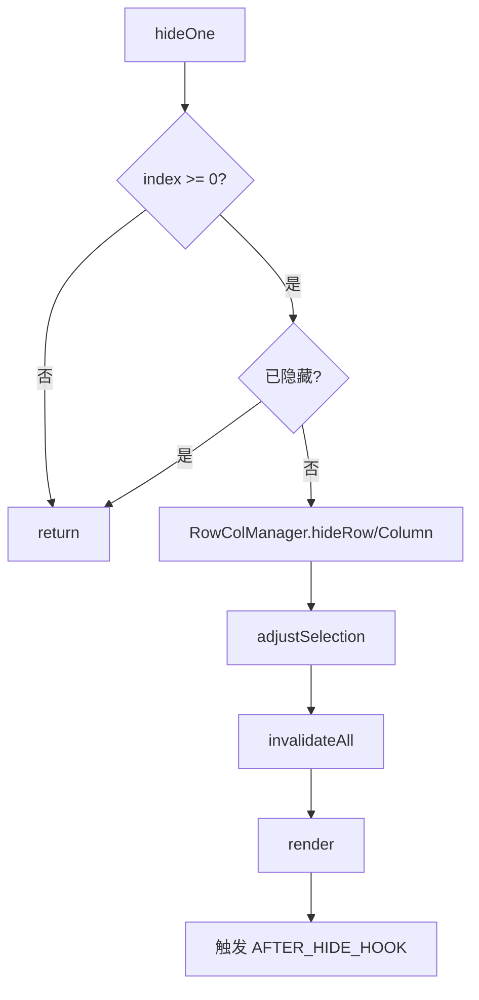
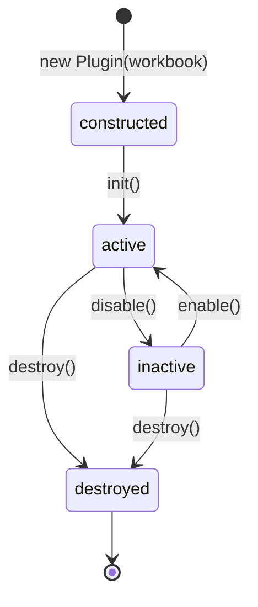

# BaseHidePlugin

## 概述

`BaseHidePlugin` 是隐藏行/列功能的通用基类，继承自 `BasePlugin`。它消除了 `HiddenRowsPlugin` 与 `HiddenColumnsPlugin` 之间的代码重复，通过维度抽象实现统一的隐藏/显示逻辑。

## 核心设计：维度抽象

行和列的操作逻辑完全对称，唯一区别是操作对象。`BaseHidePlugin` 通过以下机制实现维度无关的代码复用：

```
                     BaseHidePlugin
                    (AXIS = 抽象)
                   /                \
        HiddenRowsPlugin        HiddenColumnsPlugin
       (AXIS = "row")          (AXIS = "col")
```

**子类只需提供三个静态属性**：

| 静态属性 | 说明 | `HiddenRowsPlugin` | `HiddenColumnsPlugin` |
|----------|------|-------------------|----------------------|
| `AXIS` | 操作维度 | `"row"` | `"col"` |
| `AFTER_HIDE_HOOK` | 隐藏后钩子 | `HOOK.AFTER_HIDE_ROW` | `HOOK.AFTER_HIDE_COLUMN` |
| `AFTER_SHOW_HOOK` | 显示后钩子 | `HOOK.AFTER_SHOW_ROW` | `HOOK.AFTER_SHOW_COLUMN` |

## 核心原理：尺寸归零方案

隐藏时将该行/列的高度/宽度设为 0，显示时恢复原始尺寸。

**对比双坐标体系方案**：

| 方案 | 隐藏方式 | 复杂度 | 坐标映射 |
|------|----------|--------|----------|
| 尺寸归零（当前） | `height/width = 0` | 低 | 无需额外映射 |
| 双坐标体系 | 维护物理↔可视映射 | 高 | 每次操作需转换 |

尺寸归零方案的优势：
- 所有坐标计算自然适配，无需索引转换
- 代码量更少，逻辑更清晰
- 与冻结、选区等模块兼容性好

## 类结构

```
BaseHidePlugin extends BasePlugin
├── 静态属性（子类覆盖）
│   ├── AXIS                  → "row" | "col"
│   ├── AFTER_HIDE_HOOK       → 隐藏后钩子名
│   └── AFTER_SHOW_HOOK       → 显示后钩子名
├── 实例字段
│   └── #active               → 激活状态
├── 维度抽象（私有 getter）
│   ├── #axis                 → 当前维度
│   ├── #isRow                → 是否行维度
│   └── #dimCapitalized       → 首字母大写（"Row"/"Column"）
├── 动态调度（私有方法）
│   ├── #rcHide(index)        → hideRow / hideColumn
│   ├── #rcShow(index)        → showRow / showColumn
│   ├── #rcIsHidden(index)    → isRowHidden / isColumnHidden
│   ├── #rcGetHidden()        → getHiddenRows / getHiddenColumns
│   ├── #rcClearHidden()      → clearHiddenRows / clearHiddenColumns
│   └── #rcVisibleCount()     → visibleRowCount / visibleColCount
├── 公共 API
│   ├── init(options)
│   ├── hideOne(index)
│   ├── hideMultiple(items)
│   ├── showOne(index)
│   ├── showMultiple(items)
│   ├── isHidden(index)
│   ├── getHiddenItems()
│   ├── active (getter)
│   ├── hiddenItems (getter)
│   ├── hiddenCount (getter)
│   └── visibleCount (getter)
├── 选区保护（私有方法）
│   ├── #adjustSelection()
│   └── #findNearestVisible(idx)
└── 生命周期
    ├── enable()
    ├── disable()
    └── destroy()
```

## API 详解

### 初始化

#### `init(options?)`

从配置中读取预隐藏项列表并执行隐藏。

| 参数 | 类型 | 说明 |
|------|------|------|
| `options.rows` | `number[]` | 初始隐藏的行索引（仅 `HiddenRowsPlugin`） |
| `options.columns` | `number[]` | 初始隐藏的列索引（仅 `HiddenColumnsPlugin`） |

```js
// 初始化时隐藏第 3、5、7 行
new HiddenRowsPlugin(workbook).init({ rows: [3, 5, 7] });

// 初始化时隐藏第 2、4 列
new HiddenColumnsPlugin(workbook).init({ columns: [2, 4] });
```

初始化流程：
1. 调用 `super.init(options)` 保存配置
2. 根据维度读取 `options.rows` 或 `options.columns`
3. 逐个调用 `#rcHide()` 隐藏
4. 调整选区确保可见
5. 失效渲染缓存并重绘

---

### 隐藏操作

#### `hideOne(index)`

隐藏单个行/列。

| 参数 | 类型 | 说明 |
|------|------|------|
| `index` | `number` | 行/列索引，必须 ≥ 0 |

**执行流程**：



---

#### `hideMultiple(items)`

批量隐藏多个行/列。与逐个调用 `hideOne` 的区别在于**渲染和选区调整只执行一次**，减少重绘开销。

| 参数 | 类型 | 说明 |
|------|------|------|
| `items` | `number[]` | 要隐藏的行/列索引数组 |

```js
// 批量隐藏，仅触发一次重绘
plugin.hideMultiple([2, 3, 5, 7]);
```

---

### 显示操作

#### `showOne(index)`

显示（取消隐藏）单个行/列，恢复原始尺寸。

| 参数 | 类型 | 说明 |
|------|------|------|
| `index` | `number` | 要显示的行/列索引 |

#### `showMultiple(items)`

批量显示多个行/列。渲染和选区调整只执行一次。

| 参数 | 类型 | 说明 |
|------|------|------|
| `items` | `number[]` | 要显示的行/列索引数组 |

---

### 查询方法

#### `isHidden(index)`

判断指定索引是否已隐藏。

| 参数 | 类型 | 说明 |
|------|------|------|
| `index` | `number` | 行/列索引 |

| 返回 | 说明 |
|------|------|
| `boolean` | 是否已隐藏，sheet 不存在时返回 `false` |

#### `getHiddenItems()`

获取所有已隐藏项的索引数组（同 `hiddenItems` getter）。

#### `hiddenItems`（getter）

获取所有已隐藏项的索引数组。

#### `hiddenCount`（getter）

获取已隐藏项的数量。

#### `visibleCount`（getter）

获取当前维度的可见项数量。

#### `active`（getter）

插件是否处于激活状态（已初始化且未禁用）。

---

## 选区保护机制

隐藏/显示操作后，`#adjustSelection()` 自动调整选区，确保选区始终落在可见区域。

### 调整逻辑

```
检查三个关键位置：
  1. 焦点行/列（focusIdx）
  2. 选区起始（topIdx）
  3. 选区结束（bottomIdx）

┌─ 三者均可见 ──→ 无需调整
│
└─ 任意被隐藏 ──→ #findNearestVisible() 寻找替代
                     │
                     ├─ 找到 → 更新选区
                     └─ 未找到 → 放弃
```

### `#findNearestVisible(idx)` 搜索策略

```
起始索引 idx
  ├─ idx 本身可见 → 返回 idx
  ├─ 向右搜索 (idx+1 .. idx+100)
  │    └─ 找到可见项 → 返回
  └─ 向左搜索 (idx-1 .. 0)
       └─ 找到可见项 → 返回
            └─ 全部隐藏 → 返回 -1
```

---

## 生命周期

### 状态流转



### `enable()`

恢复激活状态（`#active = true`），基类钩子守卫恢复执行。

### `disable()`

设置 `#active = false`，**清除所有隐藏状态**（恢复所有行/列），失效缓存并重绘。

### `destroy()`

先调用 `disable()` 恢复所有隐藏，再调用 `super.destroy()` 清理钩子、策略、DOM 事件等资源。

---

## 子类实现示例

```js
// HiddenRowsPlugin.js
import { BaseHidePlugin } from './BaseHidePlugin.js';
import { HOOK } from '../constants/hookNames.js';

export class HiddenRowsPlugin extends BaseHidePlugin {
    static get PLUGIN_NAME() { return 'hiddenRows'; }
    static get AXIS()           { return 'row'; }
    static get AFTER_HIDE_HOOK()  { return HOOK.AFTER_HIDE_ROW; }
    static get AFTER_SHOW_HOOK()  { return HOOK.AFTER_SHOW_ROW; }

    // 语义别名（可选，保持 API 兼容性）
    hideRow(index)    { this.hideOne(index); }
    hideRows(rows)    { this.hideMultiple(rows); }
    showRow(index)    { this.showOne(index); }
    showRows(rows)    { this.showMultiple(rows); }
    get hiddenRows()  { return this.hiddenItems; }
    getHiddenRows()   { return this.getHiddenItems(); }
    get visibleRowCount() { return this.visibleCount; }
}
```

```js
// HiddenColumnsPlugin.js
export class HiddenColumnsPlugin extends BaseHidePlugin {
    static get PLUGIN_NAME() { return 'hiddenColumns'; }
    static get AXIS()           { return 'col'; }
    static get AFTER_HIDE_HOOK()  { return HOOK.AFTER_HIDE_COLUMN; }
    static get AFTER_SHOW_HOOK()  { return HOOK.AFTER_SHOW_COLUMN; }

    // 语义别名
    hideColumn(index)     { this.hideOne(index); }
    hideColumns(cols)     { this.hideMultiple(cols); }
    showColumn(index)     { this.showOne(index); }
    showColumns(cols)     { this.showMultiple(cols); }
    get hiddenColumns()   { return this.hiddenItems; }
    getHiddenColumns()    { return this.getHiddenItems(); }
    get visibleColCount() { return this.visibleCount; }
}
```

## 设计要点

1. **静态属性驱动**：子类通过覆盖 `AXIS` 等静态属性决定行为，无需修改任何逻辑代码。
2. **动态方法调度**：`#rcHide`、`#rcShow` 等私有方法根据 `#isRow` 将调用分发到 `RowColManager` 的对应 API，避免 `if/else` 散布在业务逻辑中。
3. **选区自动保护**：隐藏/显示操作后自动调整选区，防止用户选中不可见区域。
4. **批量操作优化**：`hideMultiple` / `showMultiple` 将多次操作合并为一次渲染，避免重复重绘。
5. **disable 恢复可见**：禁用插件时自动恢复所有隐藏项，确保界面状态一致。
