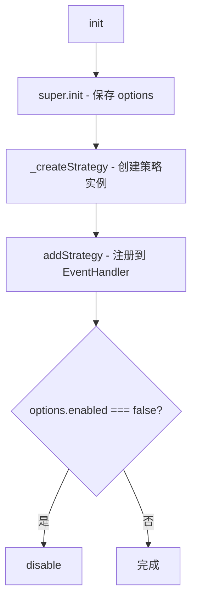
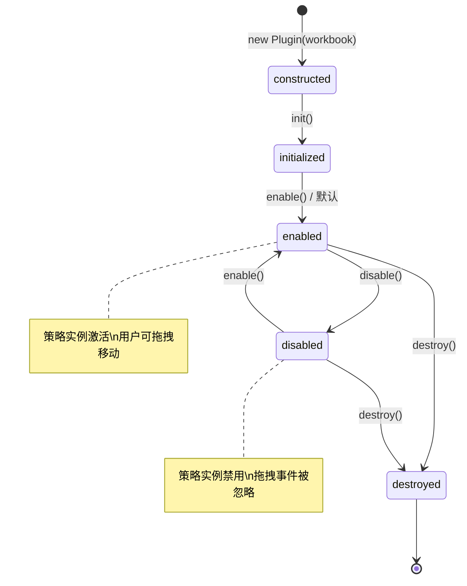

# BaseMovePlugin

## 概述

`BaseMovePlugin` 是行/列拖拽移动功能的通用基类，继承自 `BasePlugin`。它消除了 `RowMovePlugin` 与 `ColumnMovePlugin` 之间的代码重复，通过**模板方法模式**将策略创建延迟到子类。

## 设计模式

### 模板方法 + 策略模式

```
                    BaseMovePlugin
                   (模板方法模式)
                  /               \
        RowMovePlugin          ColumnMovePlugin
       _createStrategy()       _createStrategy()
             ↓                       ↓
       RowMoveStrategy        ColumnMoveStrategy
             ↘                     ↙
              EventHandler (策略模式)
```

- **模板方法**：基类定义插件生命周期骨架，子类通过 `_createStrategy()` 注入具体策略
- **策略模式**：`RowMoveStrategy` / `ColumnMoveStrategy` 封装不同的拖拽交互逻辑，通过 `addStrategy()` 注册到 `EventHandler`

### 子类差异对比

| 子类 | `PLUGIN_NAME` | `_createStrategy()` 返回 | 操作对象 |
|------|---------------|-------------------------|----------|
| `RowMovePlugin` | `"rowMove"` | `new RowMoveStrategy(...)` | 行 |
| `ColumnMovePlugin` | `"columnMove"` | `new ColumnMoveStrategy(...)` | 列 |

## 类结构

```
BaseMovePlugin extends BasePlugin
├── 实例字段
│   └── #strategy: EventStrategy | null
├── 模板方法（子类覆盖）
│   └── _createStrategy() → EventStrategy
├── 生命周期
│   ├── init(options?)
│   ├── destroy()
│   ├── enable()
│   └── disable()
└── 继承自 BasePlugin
    ├── workbook / sheet / hooks 等 getter
    ├── addHook / addStrategy / addDOMEvent
    └── render / getPlugin
```

## API 详解

### `_createStrategy()`（模板方法）

子类**必须覆盖**的工厂方法，返回对应的移动策略实例。

| 返回 | 类型 | 说明 |
|------|------|------|
| `strategy` | `EventStrategy` | 行或列移动策略实例 |

```js
// RowMovePlugin
_createStrategy() {
    return new RowMoveStrategy(this.eventHandler);
}

// ColumnMovePlugin
_createStrategy() {
    return new ColumnMoveStrategy(this.eventHandler);
}
```

---

### `init(options?)`

初始化插件，创建策略并注册。

| 参数 | 类型 | 默认值 | 说明 |
|------|------|--------|------|
| `options.enabled` | `boolean` | `true` | 是否初始启用 |

**执行流程**：



**配置示例**：

```js
// 初始化时禁用（用户无法拖拽移动行）
new RowMovePlugin(workbook).init({ enabled: false });
```

---

### `destroy()`

销毁插件，清空策略引用后调用 `super.destroy()`。基类的 `destroy()` 会自动清理：
- 通过 `addStrategy()` 注册的策略（自动移除）
- 通过 `addHook()` 注册的钩子（自动移除）
- 通过 `addDOMEvent()` 注册的 DOM 事件（自动移除）

---

### `enable()`

启用插件，同步启用策略实例。策略启用后，拖拽相关事件（如 header 上的 `mousedown`）将被正常处理。

```js
plugin.enable();
// 用户现在可以拖拽移动行/列
```

---

### `disable()`

禁用插件，同步禁用策略实例。策略禁用后，拖拽事件将被忽略。

```js
plugin.disable();
// 用户无法拖拽移动行/列，策略不会响应事件
```

---

## 生命周期状态流转



## 资源管理

`BaseMovePlugin` 利用 `BasePlugin` 的资源追踪机制：

| 资源类型 | 注册方式 | 清理方式 |
|----------|----------|----------|
| 策略实例 | `addStrategy(name, strategy)` | `destroy()` → `removeOwnStrategies()` |
| 钩子回调 | `addHook(name, callback)` | `destroy()` → `clearOwnHooks()` |
| DOM 事件 | `addDOMEvent(target, type, handler)` | `destroy()` → `removeOwnDOMEvents()` |

所有资源在 `destroy()` 时**自动清理**，无需手动管理。

## 子类完整实现

### RowMovePlugin

```js
import { BaseMovePlugin } from "./BaseMovePlugin.js";
import { RowMoveStrategy } from "../editor/strategies/RowMoveStrategy.js";

/**
 * 行拖拽移动插件
 *
 * 参考 Handsontable ManualRowMove API：
 * - 用户拖拽行头即可移动整行数据
 * - 支持 beforeRowMove / afterRowMove 钩子
 * - 可通过 pluginOptions.rowMove.enabled = false 禁用
 */
export class RowMovePlugin extends BaseMovePlugin {
    static get PLUGIN_NAME() {
        return "rowMove";
    }

    /** @override */
    _createStrategy() {
        return new RowMoveStrategy(this.eventHandler);
    }
}
```

### ColumnMovePlugin

```js
import { BaseMovePlugin } from "./BaseMovePlugin.js";
import { ColumnMoveStrategy } from "../editor/strategies/ColumnMoveStrategy.js";

/**
 * 列拖拽移动插件
 *
 * 参考 Handsontable ManualColumnMove API。
 */
export class ColumnMovePlugin extends BaseMovePlugin {
    static get PLUGIN_NAME() {
        return "columnMove";
    }

    /** @override */
    _createStrategy() {
        return new ColumnMoveStrategy(this.eventHandler);
    }
}
```

### 使用方式

```js
const wb = new Workbook('grid', {
    plugins: ['rowMove', 'columnMove'],
    pluginOptions: {
        rowMove: { enabled: true },
        columnMove: { enabled: true }
    }
});

// 运行时控制
const rowMove = wb.getPlugin('rowMove');
rowMove.disable();  // 禁止拖拽移动行
rowMove.enable();   // 恢复拖拽移动行
```

## 设计要点

1. **模板方法模式**：基类定义初始化骨架（创建策略 → 注册 → 配置检查），子类仅注入策略实例，逻辑零重复。
2. **策略与插件解耦**：策略实例独立管理交互逻辑，插件仅负责生命周期。策略的启用/禁用通过 `enable()`/`disable()` 同步。
3. **资源自动清理**：利用 `BasePlugin` 的 `addStrategy()` 追踪机制，`destroy()` 时自动移除策略，避免内存泄漏。
4. **配置驱动**：通过 `options.enabled` 控制初始状态，支持声明式配置和命令式 API 两种控制方式。
5. **命名约定**：`_createStrategy()` 以下划线开头表示 protected 方法（JS 无原生 protected，通过命名约定模拟），子类覆盖时用 `@override` 标注。
