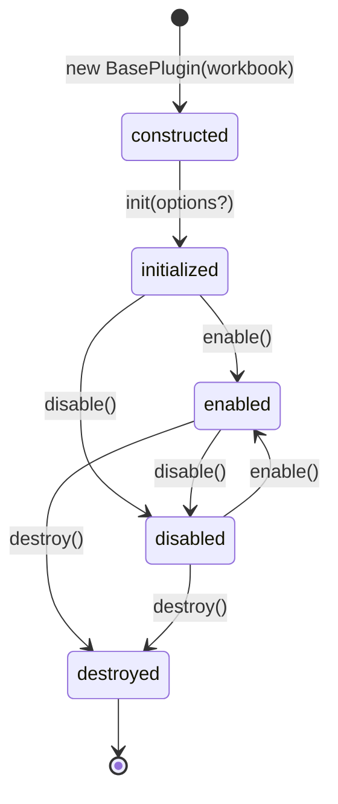

# BasePlugin

## 概述

`BasePlugin` 是所有自定义插件的基类，参考 [Handsontable BasePlugin](https://handsontable.com/docs/javascript-data-grid/api/base-plugin/) 设计。它提供了插件生命周期管理、资源自动追踪与清理、以及便捷的 Workbook 子系统访问能力。

## 类图

```
BasePlugin
├── 静态属性
│   └── PLUGIN_NAME      (子类必须覆盖)
├── 实例属性 (私有)
│   ├── #workbook
│   ├── #initialized
│   ├── #enabled
│   ├── #options
│   ├── #registeredHooks
│   ├── #registeredStrategies
│   └── #registeredDOMEvents
├── Getter 访问器
│   ├── workbook
│   ├── sheet
│   ├── renderEngine
│   ├── eventHandler
│   ├── editor
│   ├── hooks
│   ├── clipboard
│   ├── options
│   ├── initialized
│   └── enabled
├── 生命周期方法
│   ├── init(options?)
│   ├── destroy()
│   ├── enable()
│   └── disable()
├── 资源管理方法
│   ├── addHook(hookName, callback)
│   ├── addHookOnce(hookName, callback)
│   ├── clearOwnHooks()
│   ├── addStrategy(name, strategy)
│   ├── removeOwnStrategies()
│   ├── addDOMEvent(target, eventType, handler, options?)
│   └── removeOwnDOMEvents()
└── 工具方法
    ├── render()
    └── getPlugin(pluginName)
```

## 静态属性

### `PLUGIN_NAME`

**类型**：`string`

**说明**：插件名称标识，每个子类**必须覆盖**此属性，否则访问时抛出 `Error`。

```js
static get PLUGIN_NAME() {
    return 'myPlugin';
}
```

---

## Getter 访问器

通过以下 getter 可便捷访问 Workbook 的各个子系统，无需手动传递引用：

| 访问器 | 返回类型 | 说明 |
|--------|----------|------|
| `workbook` | `Workbook` | Workbook 门面实例 |
| `sheet` | `Sheet` | 当前活动工作表（`workbook.activeSheet`） |
| `renderEngine` | `RenderEngine` | 渲染引擎 |
| `eventHandler` | `EventHandler` | 事件处理器（管理策略与钩子） |
| `editor` | `EditorManager` | 编辑器管理器 |
| `hooks` | `Hooks` | 钩子系统 |
| `clipboard` | `ClipboardManager` | 剪贴板管理器 |
| `options` | `object` | 插件配置对象（由 `init()` 注入） |
| `initialized` | `boolean` | 插件是否已初始化 |
| `enabled` | `boolean` | 插件是否已启用 |

> **注意**：`sheet` 在 `activeSheet` 切换时会自动变化，无需手动更新引用。

---

## 生命周期



### `constructor(workbook)`

**参数**：

| 参数 | 类型 | 说明 |
|------|------|------|
| `workbook` | `Workbook` | Workbook 实例 |

**说明**：构造函数仅保存 `workbook` 引用，不执行任何初始化逻辑。所有初始化应在 `init()` 中完成。

---

### `init(options?)`

**参数**：

| 参数 | 类型 | 默认值 | 说明 |
|------|------|--------|------|
| `options` | `object` | `{}` | 插件配置 |

**说明**：初始化插件。基类实现会保存 `options` 并设置 `initialized = true`。子类应覆盖此方法以注册钩子、策略等。

**示例**：

```js
class MyPlugin extends BasePlugin {
    init(options = {}) {
        super.init(options); // 必须调用父类

        this.addHook('onCellClick', (row, col) => {
            console.log(`点击了 (${row}, ${col})`);
        });
    }
}
```

---

### `destroy()`

**说明**：销毁插件，自动清理三类资源：

1. 通过 `addHook` / `addHookOnce` 注册的钩子
2. 通过 `addStrategy` 注册的策略
3. 通过 `addDOMEvent` 注册的 DOM 事件

然后设置 `initialized = false` 和 `enabled = false`。

```js
destroy() {
    // 子类自定义清理逻辑
    this.clearOwnHooks();  // 可选，基类 destroy 已自动调用
    super.destroy();       // 必须调用
}
```

---

### `enable()`

**说明**：启用插件，设置 `enabled = true`。启用后，`addHook` 注册的回调将正常执行。

### `disable()`

**说明**：禁用插件，设置 `enabled = false`。禁用后，`addHook` 注册的回调会被跳过（但仍保留注册）。

---

## 资源管理

### `addHook(hookName, callback)`

注册一个钩子回调，**自动追踪**以便 `destroy()` 时清理。

**关键行为**：回调被自动包装，在执行前检查 `enabled` 状态——禁用插件的钩子回调会被跳过。

| 参数 | 类型 | 说明 |
|------|------|------|
| `hookName` | `string` | 钩子名称（如 `'onCellClick'`） |
| `callback` | `Function` | 回调函数 |

```js
this.addHook('onSelectionChange', (selection) => {
    // 仅在插件 enabled 时执行
});
```

---

### `addHookOnce(hookName, callback)`

注册一个**一次性**钩子回调，触发后自动移除。

```js
this.addHookOnce('onAfterRender', () => {
    console.log('仅执行一次');
});
```

---

### `clearOwnHooks()`

手动清理本插件注册的所有钩子。`destroy()` 会自动调用此方法。

---

### `addStrategy(name, strategy)`

注册一个事件策略，**自动追踪**以便 `destroy()` 时清理。

| 参数 | 类型 | 说明 |
|------|------|------|
| `name` | `string` | 策略名称 |
| `strategy` | `EventStrategy` | 策略实例 |

```js
this.addStrategy('myStrategy', new MyStrategy(this.eventHandler));
```

---

### `removeOwnStrategies()`

移除本插件注册的所有策略。`destroy()` 会自动调用此方法。

---

### `addDOMEvent(target, eventType, handler, options?)`

注册一个 DOM 事件监听器，**自动追踪**以便 `destroy()` 时清理。

| 参数 | 类型 | 说明 |
|------|------|------|
| `target` | `EventTarget` | 事件目标（如 `canvas`、`document`） |
| `eventType` | `string` | 事件类型（如 `'click'`、`'keydown'`） |
| `handler` | `Function` | 事件处理函数 |
| `options` | `object` | `addEventListener` 的选项（可选） |

```js
this.addDOMEvent(document, 'keydown', this.#handleKeyDown.bind(this));
```

---

### `removeOwnDOMEvents()`

移除本插件注册的所有 DOM 事件。`destroy()` 会自动调用此方法。

---

## 工具方法

### `render()`

触发 Workbook 重新渲染。

```js
// 数据变更后强制重绘
this.render();
```

---

### `getPlugin(pluginName)`

获取其他已加载的插件实例，用于跨插件通信。

| 参数 | 类型 | 说明 |
|------|------|------|
| `pluginName` | `string` | 目标插件的 `PLUGIN_NAME` |

| 返回 | 说明 |
|------|------|
| `BasePlugin \| null` | 找到的插件实例，未找到返回 `null` |

```js
const freezePlugin = this.getPlugin('freeze');
if (freezePlugin) {
    freezePlugin.update();
}
```

---

## 完整示例

```js
import { BasePlugin } from '../plugins/index.js';
import { MyStrategy } from '../editor/strategies/MyStrategy.js';

export class MyPlugin extends BasePlugin {
    /** @override */
    static get PLUGIN_NAME() {
        return 'myPlugin';
    }

    /** @override */
    init(options = {}) {
        super.init(options);

        // 注册钩子（自动启用/禁用感知）
        this.addHook('onCellClick', this.#onCellClick.bind(this));
        this.addHook('onAfterRender', this.#onAfterRender.bind(this));

        // 注册事件策略
        this.addStrategy('myStrategy', new MyStrategy(this.eventHandler));

        // 注册 DOM 事件
        this.addDOMEvent(document, 'keydown', this.#onKeyDown.bind(this));
    }

    #onCellClick(row, col) {
        const value = this.sheet.getCellValue(row, col);
        console.log(`Cell (${row}, ${col}): ${value}`);
    }

    #onAfterRender() {
        // 渲染后处理
    }

    #onKeyDown(e) {
        if (e.key === 'Escape') {
            this.disable();
        }
    }

    /** @override */
    destroy() {
        // 自定义清理
        // ... 
        super.destroy(); // 自动清理钩子、策略、DOM 事件
    }
}
```

## 设计要点

1. **资源自动清理**：所有通过 `addHook` / `addStrategy` / `addDOMEvent` 注册的资源都会被追踪，调用 `destroy()` 时自动清理，避免内存泄漏。
2. **启用/禁用感知**：`addHook` 注册的回调在执行前会自动检查 `enabled` 状态，禁用的插件其钩子回调会被静默跳过。
3. **一次性钩子**：`addHookOnce` 适合只需要触发一次的初始化逻辑。
4. **跨插件通信**：通过 `getPlugin()` 可安全地获取其他插件实例进行交互。
