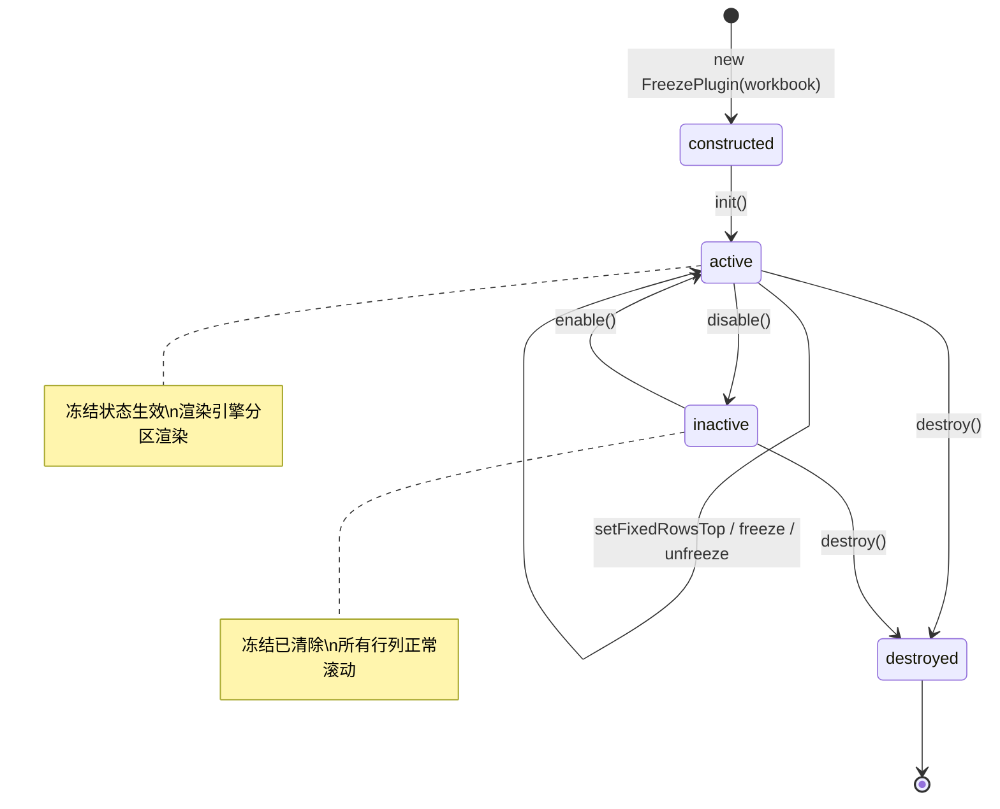

# FreezePlugin

## 概述

`FreezePlugin` 是冻结行列插件，继承自 `BasePlugin`。它实现了类似 Excel 的"冻结窗格"功能，使指定行/列在滚动时保持固定不动——冻结行固定在视口顶部，冻结列固定在视口左侧。

## 与 Handsontable 的对应关系
.0
| 本项目 | Handsontable | 说明 |
|--------|-------------|------|
| `fixedRowsTop` | `fixedRowsTop` | 顶部冻结行数 |
| `fixedColumnsStart` | `fixedColumnsStart` | 左侧冻结列数 |
| `freeze(rows, cols)` | 无直接对应 | 便捷方法，同时设置行列冻结 |
| `unfreeze()` | 无直接对应 | 一键取消所有冻结 |

## 核心原理：视口分区渲染

冻结状态存储在 `Sheet` 实例的 `fixedRowsTop` / `fixedColumnsStart` 属性中，渲染引擎根据这些属性将视口拆分为四个裁剪区域分别渲染：

```
┌──────────────┬────────────────────────────┐
│              │                            │
│   左上角     │    冻结行 × 可滚动列        │
│  (冻结行×    │    scrollY = 0             │
│   冻结列)    │    仅水平滚动              │
│              │                            │
├──────────────┼────────────────────────────┤
│              │                            │
│  冻结列 ×    │                            │
│  可滚动行    │      可滚动区域             │
│  scrollX = 0 │      正常双向滚动          │
│  仅垂直滚动  │                            │
│              │                            │
└──────────────┴────────────────────────────┘
```

四个区域的渲染策略：

| 区域 | scrollX | scrollY | 说明 |
|------|---------|---------|------|
| 冻结行 × 冻结列 | 0 | 0 | 始终固定，不随任何滚动移动 |
| 冻结行 × 可滚动列 | 正常 | 0 | 仅水平滚动，垂直方向固定 |
| 可滚动行 × 冻结列 | 0 | 正常 | 仅垂直滚动，水平方向固定 |
| 可滚动区域 | 正常 | 正常 | 正常双向滚动 |

**表头同步冻结**：行头（Row Header）和列头（Column Header）也参与冻结——冻结行的行头不随垂直滚动移动，冻结列的列头不随水平滚动移动。通过覆盖渲染策略实现：先渲染可滚动区域的表头，再用 `scrollX=0` / `scrollY=0` 覆盖渲染冻结区域的表头。

**冻结线**：在冻结区域与可滚动区域的交界处绘制绿色分割线（`#217346`，2px），提供视觉反馈。

## 类结构

```
FreezePlugin extends BasePlugin
├── 静态属性
│   └── PLUGIN_NAME           → "freeze"
├── 实例字段
│   └── #active               → 激活状态
├── 只读属性
│   ├── active                → 是否激活
│   ├── fixedRowsTop          → 当前冻结行数
│   └── fixedColumnsStart     → 当前冻结列数
├── 公共 API
│   ├── setFixedRowsTop(count)
│   ├── setFixedColumnsStart(count)
│   ├── freeze(rows, cols)
│   ├── unfreeze()
│   └── isFrozen()
├── 私有方法
│   ├── #applyAndNotify(oldRows, oldCols)
│   └── #notifyFreezeChange(oldRows, oldCols)
└── 生命周期
    ├── init(options?)
    ├── enable()
    ├── disable()
    └── destroy()
```

## API 详解

### 初始化

#### `init(options?)`

从配置中读取冻结参数并应用到 Sheet。

| 参数 | 类型 | 默认值 | 说明 |
|------|------|--------|------|
| `options.fixedRowsTop` | `number` | — | 顶部冻结行数，仅正整数生效 |
| `options.fixedColumnsStart` | `number` | — | 左侧冻结列数，仅正整数生效 |

```js
const wb = new Workbook('grid', {
    plugins: ['freeze'],
    pluginOptions: {
        freeze: { fixedRowsTop: 1, fixedColumnsStart: 2 }
    }
});
```

初始化流程：
1. 调用 `super.init(options)` 保存配置
2. 读取 `options.fixedRowsTop` / `options.fixedColumnsStart`，仅正值生效
3. 写入 Sheet 的对应属性
4. 失效渲染缓存并重绘

---

### 冻结操作

#### `setFixedRowsTop(count)`

设置顶部冻结行数。修改后自动触发重绘和钩子通知。

| 参数 | 类型 | 说明 |
|------|------|------|
| `count` | `number` | 冻结行数，0 取消行冻结，负值自动归零 |

**钩子通知逻辑**：
- 仍有冻结（行或列 > 0）→ 触发 `AFTER_FREEZE`
- 从有冻结变为无冻结 → 触发 `AFTER_UNFREEZE`

```js
const freeze = wb.getPlugin('freeze');
freeze.setFixedRowsTop(2);   // 冻结前 2 行
freeze.setFixedRowsTop(0);   // 取消行冻结（若列也无冻结 → AFTER_UNFREEZE）
```

---

#### `setFixedColumnsStart(count)`

设置左侧冻结列数。修改后自动触发重绘和钩子通知。

| 参数 | 类型 | 说明 |
|------|------|------|
| `count` | `number` | 冻结列数，0 取消列冻结，负值自动归零 |

```js
freeze.setFixedColumnsStart(1);  // 冻结首列
freeze.setFixedColumnsStart(0);  // 取消列冻结
```

---

#### `freeze(rows, cols)`

便捷方法，同时设置冻结行数和列数。一次调用完成双向冻结，始终触发 `AFTER_FREEZE` 钩子。

| 参数 | 类型 | 说明 |
|------|------|------|
| `rows` | `number` | 冻结行数 |
| `cols` | `number` | 冻结列数 |

```js
freeze.freeze(2, 1);  // 冻结前 2 行 + 前 1 列
freeze.freeze(0, 3);  // 仅冻结前 3 列
freeze.freeze(1, 0);  // 仅冻结首行
```

---

#### `unfreeze()`

取消所有冻结，将行和列的冻结数同时归零。仅在之前存在冻结时触发 `AFTER_UNFREEZE` 钩子。

```js
freeze.unfreeze();     // 取消所有冻结
freeze.isFrozen();     // false
```

---

### 查询方法

#### `isFrozen()`

判断当前是否存在冻结（行或列）。

| 返回 | 类型 | 说明 |
|------|------|------|
| `boolean` | `boolean` | 是否存在冻结，sheet 不存在时返回 `false` |

#### `fixedRowsTop`（getter）

当前顶部冻结行数。

#### `fixedColumnsStart`（getter）

当前左侧冻结列数。

#### `active`（getter）

插件是否处于激活状态（已初始化且未禁用）。

---

## 私有方法

### `#applyAndNotify(oldRows, oldCols)`

应用渲染刷新并通知冻结变更。被 `setFixedRowsTop` 和 `setFixedColumnsStart` 共用，消除两者之间的重复逻辑。

执行步骤：
1. `renderEngine.invalidateAll()` — 失效所有渲染缓存
2. `render()` — 触发重绘
3. `#notifyFreezeChange(oldRows, oldCols)` — 通知钩子

### `#notifyFreezeChange(oldRows, oldCols)`

通知冻结状态变更钩子，判断逻辑如下：

```
当前状态判断：
  ├─ 仍有冻结（行或列 > 0）→ AFTER_FREEZE(rows, cols)
  ├─ 无冻结，但之前有冻结  → AFTER_UNFREEZE
  └─ 无冻结，之前也无冻结  → 不触发钩子
```

`oldRows` / `oldCols` 参数可选：
- `freeze()` 调用时不传（一定是冻结操作，无需判断 AFTER_UNFREEZE）
- `setFixedRowsTop()` / `setFixedColumnsStart()` 调用时传入旧值，用于判断是否需要触发 `AFTER_UNFREEZE`

---

## 钩子

| 钩子名 | 触发时机 | 参数 |
|--------|----------|------|
| `AFTER_FREEZE` | 冻结变更后（仍有冻结） | `(rows: number, cols: number)` |
| `AFTER_UNFREEZE` | 从有冻结变为无冻结 | 无 |

```js
wb.hooks.addHook(HOOKS.AFTER_FREEZE, (rows, cols) => {
    console.log(`冻结: ${rows} 行, ${cols} 列`);
});

wb.hooks.addHook(HOOKS.AFTER_UNFREEZE, () => {
    console.log('已取消所有冻结');
});
```

---

## 生命周期

### 状态流转



### `enable()`

恢复激活状态。注意：**不会自动恢复之前的冻结配置**，需要手动调用 `freeze()` 或 `setFixedRowsTop()` 等方法重新设置。

### `disable()`

清除所有冻结状态（行和列归零），失效缓存并重新渲染。禁用后用户无法看到任何冻结效果。

### `destroy()`

先调用 `disable()`（清除冻结状态），再调用 `super.destroy()` 清理钩子、策略、DOM 事件等资源。

---

## 渲染管线集成

`FreezePlugin` 的冻结状态由以下模块协同消费：

| 模块 | 消费方式 | 说明 |
|------|----------|------|
| `Sheet` | `fixedRowsTop` / `fixedColumnsStart` 属性 | 存储冻结配置 |
| `Sheet.frozenRowsHeight` | getter | 冻结行的总高度 |
| `Sheet.frozenColsWidth` | getter | 冻结列的总宽度 |
| `RenderEngine` | 裁剪区域渲染 | 四区域分区绘制 |
| `HeaderRenderer` | 覆盖渲染 | 冻结区域的表头用 scrollX/Y=0 覆盖 |
| `ScrollManager` | 滚动边界调整 | `maxScrollX/Y` 扣除冻结区域尺寸 |
| `ContextMenuStrategy` | 右键菜单 | "冻结首行"、"冻结首列"、"取消冻结" |

---

## 上下文菜单集成

用户可通过右键菜单操作冻结：

| 菜单项 | 调用方法 | 条件 |
|--------|----------|------|
| 冻结首行 | `setFixedRowsTop(1)` | 无冻结时显示 |
| 冻结首列 | `setFixedColumnsStart(1)` | 无冻结时显示 |
| 取消冻结 | `unfreeze()` | 有冻结时显示 |

---

## 设计要点

1. **行列耦合**：冻结行和冻结列是同一个功能的两个维度，不拆分为独立插件。`freeze(rows, cols)` 和 `unfreeze()` 是原子操作，行列冻结状态同步管理。
2. **覆盖渲染策略**：表头冻结通过"先渲染可滚动区域，再用 scrollX/Y=0 覆盖渲染冻结区域"实现，避免复杂的条件分支。
3. **钩子去重**：`#applyAndNotify` 和 `#notifyFreezeChange` 提取了 `setFixedRowsTop` / `setFixedColumnsStart` 的重复逻辑（失效缓存 + 重新渲染 + 钩子通知），确保每次操作只触发一次钩子。
4. **滚动边界保护**：`ScrollManager` 在计算 `maxScrollX/Y` 时扣除冻结区域尺寸，确保可滚动区域不会滚入冻结区域。
5. **disable 清除冻结**：禁用插件时自动归零冻结配置，确保界面状态一致；重新启用后需手动设置冻结。